# pr0102 - Entornos multimáquina

[Enlace al enunciado](https://github.com/vgonzalez165/apuntes_aso/blob/main/ut01/practicas/pr0102.md)

[Volver al Índice](../../index.md)

Vamos a crear un proyecto para trabajar con dos máquinas virtuales con distintos sistemas operativos, siendo estos Windows Server 2019 y Windows 10.

### Windows Server 2019

Box elegida: ```gusztavvargadr/windows-server-2019-standard```

### Windows 10

Box elegida: ```gusztavvargadr/windows-10```

## Problemas encontrados

-Al probar las máquinas tuve problemas con la primera box de Windows Server que seleccioné. Esto lo pude solventar utilizando otra box distinta, la que he mencionado más arriba.

-Al iniciar las máquinas obtuve distintos mensajes de error, y probé a añadir más Memoria RAM para ayudar a la ejecución de los sistemas operativos. Ha sido suficiente con poner a cada máquina **4096 MB de RAM** y **4 núcleos de CPU**, en lugar de usar las especificaciones del enunciado.

-Al configurar las máquinas correctamente, no se comunicaban entre sí haciendo ping entre ellas (sí podía conectarme por escritorio remoto desde una a la otra). Esto lo he solucionado entrando al firewall de cada máquina y activando la regla para permitir comunicaciones de Ping por IPv4:

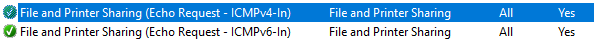

Después de esto, ya hay comunicación entre ellas

## Procedimiento

Primero, inicié una máquina en el directorio de mi práctica **pr0102** con la configuración mínima para después editar el archivo **Vagrantfile**.

```vagrant init gusztavvargadr/windows-server-2019-standard --minimal```

Entramos a Vagrantfile para modificarlo con los requisitos de la práctica:

```v
Vagrant.configure("2") do |config|
  config.vm.define "maquina1" do |maq1|
    maq1.vm.box = "gusztavvargadr/windows-server-2019-standard"
    maq1.vm.hostname = "windows2019Server"
    maq1.vm.network "private_network", ip: "10.0.0.15"
    maq1.vm.provider "virtualbox" do |vb1|
      vb1.name = "Win2019Server"
      vb1.memory = 4096
      vb1.cpus = 4
    end
  end
  config.vm.define "maquina2" do |maq2|
    maq2.vm.box = "gusztavvargadr/windows-10"
    maq2.vm.hostname = "Windows10"
    maq2.vm.network "private_network", ip: "10.0.0.16"
    maq2.vm.provider "virtualbox" do |vb2|
      vb2.name = "Win10"
      vb2.memory = 4096
      vb2.cpus = 4
    end
  end
end
```


En las líneas 5-14 definimos nuestra primera máquina, dándole el prefijo ```maq1``` para después gestionar su configuración, indicándole primero la **box** que va a utilizar, el **nombre del equipo**, la **interfaz de red privada** y finalmente la **configuración de VirtualBox**, donde indicamos las características de la máquina virtual.

En las líneas 15-24 hacemos lo mismo para la **máquina 2**, seleccionando la box de Windows 10.


### Iniciando las máquinas
 Cuando la configuración esté lista, iniciamos las máquinas desde el directorio de la práctica mediante ```vagrant up```.

 Cuando inicien, activaremos la opción de Conexión por Escritorio Remoto en ambas máquinas para poder conectarnos a ellas desde nuestro host.

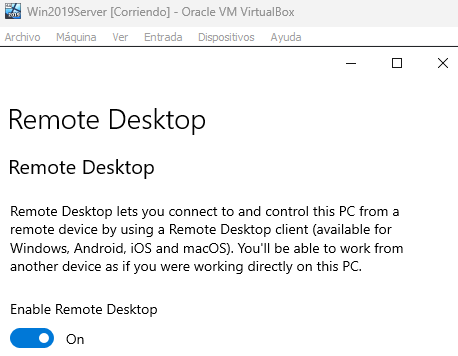

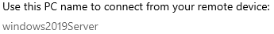

 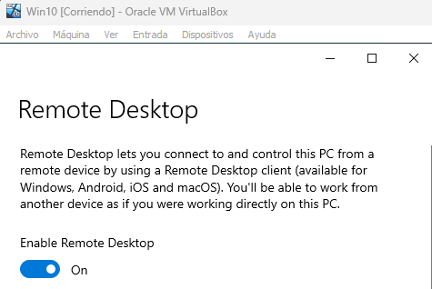

 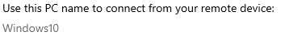

 Veremos al activar el Escritorio Remoto los hostnames que hemos establecido en cada máquina. Podremos conectarnos desde nuestro host introduciendo la **dirección IP** de las máquinas o introduciendo el **nombre del equipo** de cada máquina.

Las máquinas no hacen ping entre ellas, pero sí podemos conectarnos de una a otra mediante **Escritorio Remoto**, a través del **hostname** de la otra máquina o de su **dirección IP**.

## Conexión por Escritorio Remoto desde host.

Desde nuestro host, abriremos "Conexión a Escritorio Remoto", y probaremos a conectarnos a ambas máquinas. Como ya dije antes, podemos conectarnos mediante su **hostname** o su **dirección IP**.

- Windows Server 2019:

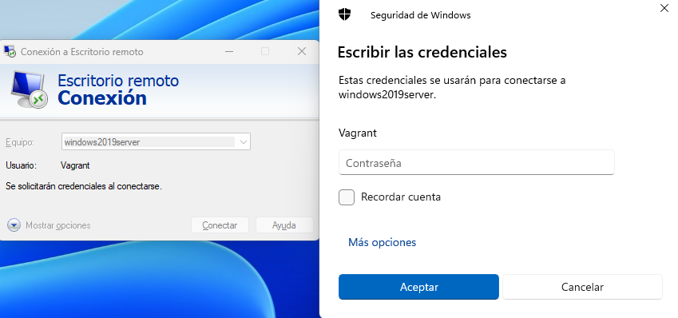

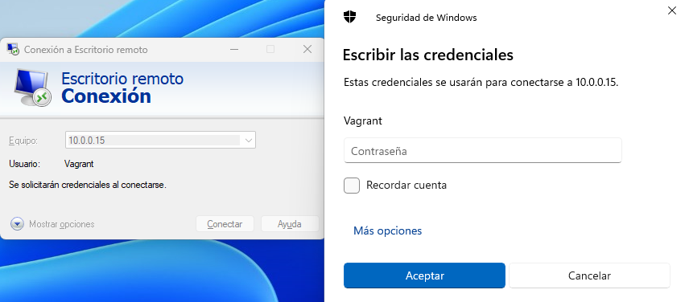

Introduciendo la contraseña vagrant podremos establecer la conexión.

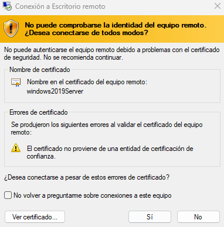

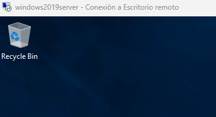
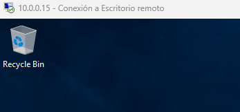


- Windows 10:

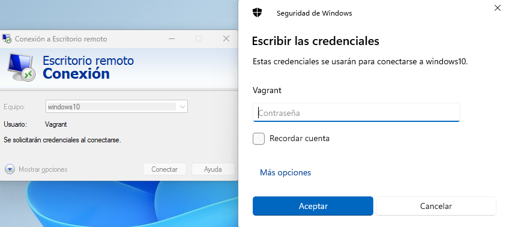

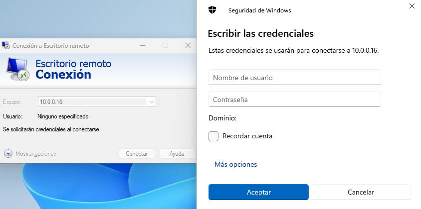

Introduciendo la misma contraseña estableceremos la conexión.

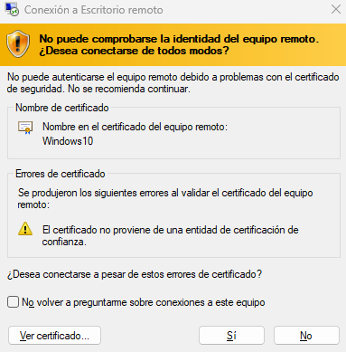

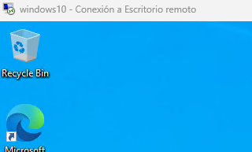
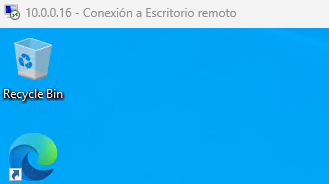

También podremos conectarnos a cada máquina desde nuestro terminal con el comando ```vagrant rdp <nombre_máquina>```. En <nombre_máquina> escribiremos maquina1 o maquina2. Se iniciará la aplicación de escritorio remoto y podremos acceder a nuestra máquina como antes.

```
PS D:\ASO\aso_aya\UT01_introduccion\practicas\pr0102> vagrant rdp maquina1
==> maquina1: Detecting RDP info...
    maquina1: Address: 127.0.0.1:53389
    maquina1: Username: vagrant
==> maquina1: Vagrant will now launch your RDP client with the connection parameters
==> maquina1: above. If the connection fails, verify that the information above is
==> maquina1: correct. Additionally, make sure the RDP server is configured and
==> maquina1: running in the guest machine (it is disabled by default on Windows).
==> maquina1: Also, verify that the firewall is open to allow RDP connections.
```


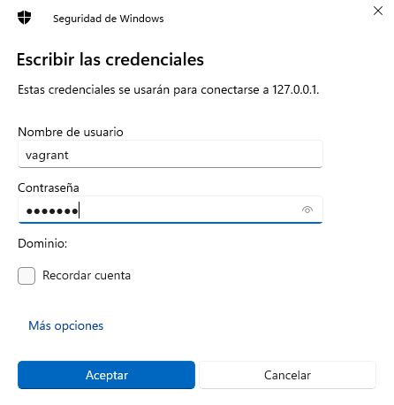

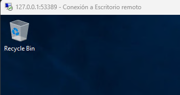