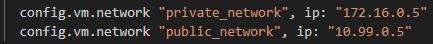

# pr0103

[Enlace al enunciado](https://github.com/vgonzalez165/apuntes_aso/blob/main/ut01/pr0103.md)

Comenzamos iniciando vagrant en el nuevo directorio para la máquina, y modificamos el fichero vagrantfile como sigue:


Con esto habremos dado nombre a la máquina virtual, los 3 GB de RAM y dos núcleos virtuales, además de nombre de equipo web-aya.


### Adaptadores de red

Ahora vamos a añadir un adaptador de red privada con la IP 172.16.0.0/16; y otro para red pública para la red 10.99.0.0/16.

Quedará así:



### Página Web

Cuando nuestra máquina esté configurada, instalaremos el paquete **apache2**.

Podremos ver la web resultante accediendo a la dirección que le hemos dado a nuestra máquina ```172.16.0.5```

Modificando el archivo ```index.html``` en el directorio ```/var/www/html/``` podremos personalizar la web a nuestro gusto. Yo he creado un par de páginas y añadido un par de fotos en cada una para comprobar que funciona sin problemas.


(Para esto, he copiado las fotos desde mi equipo host a la máquina a través de una carpeta compartida)