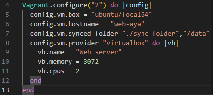
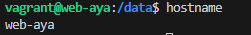
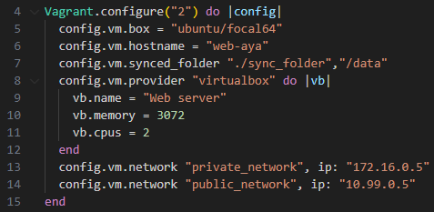
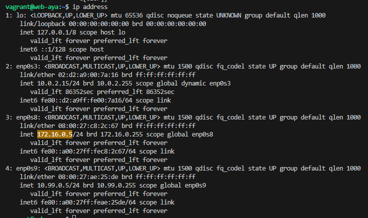
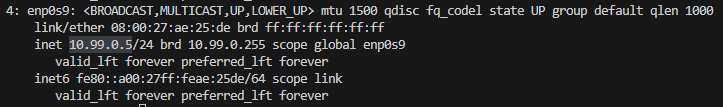
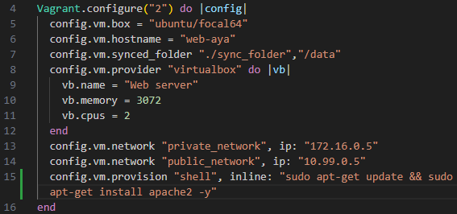
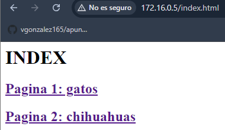
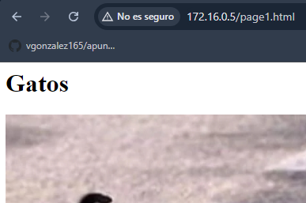
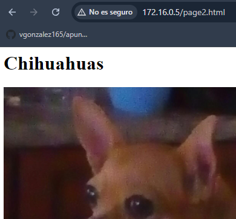

# pr0103

[Enlace al enunciado](https://github.com/vgonzalez165/apuntes_aso/blob/main/ut01/practicas/pr0103.md)

[Volver al Índice](../../index.md)

Comenzamos iniciando vagrant en el nuevo directorio para la máquina, y modificamos el fichero vagrantfile como sigue:



Con esto habremos dado nombre a la máquina virtual, 3 GB de memoria RAM y dos núcleos virtuales, además de nombre de equipo web-aya y una carpeta compartida (```sync_folder``` en nuestro host, conectada a ```/data``` en nuestra máquina virtual).



### Adaptadores de red

Ahora vamos a añadir un adaptador de red privada con la IP 172.16.0.0/16; y otro para red pública para la red 10.99.0.0/16. Esto lo incluiremos después de la configuración anterior en el archivo ```vagrantfile```.

Quedará así (líneas 14 y 15):



Comprobación en la máquina virtual:





### Aprovisionamiento para instalar Apache

Añadimos la línea de ```config.mv.provision``` seguida de el comando o comandos a ejecutar, en este caso:

```
sudo apt-get update
sudo apt-get install apache2 -y
```

Los introduciremos en el Vagranfile separado por 2 &. Las && significan que si el primer comando se ha ejecutado sin errores, ejecute el segundo. También podríamos separarlo con un ```;```. La última ```-y``` seleccionará Sí en cualquier pregunta que haga el sistema.



### Página Web

Podremos ver la web resultante que ha creado apache2 accediendo a la dirección que le hemos dado a nuestra máquina ```172.16.0.5```

Modificando el archivo ```index.html``` en el directorio ```/var/www/html/``` podremos personalizar la web a nuestro gusto. Yo he creado un par de páginas y añadido un par de fotos en cada una para comprobar que funciona sin problemas, ayudándome de la carpeta sincronizada para mover archivos.





