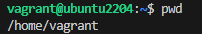
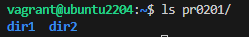
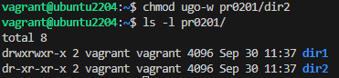
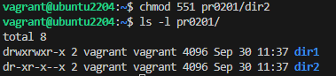
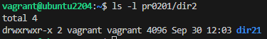

# PR0201: Usuarios y permisos

[Enlace al enunciado](https://github.com/vgonzalez165/apuntes_aso/blob/main/ut02/practicas/pr0201_usuarios_permisos.md)

[Volver al Índice](../../index.md)

En esta práctica vamos a profundizar en el ámbito de usuarios y permisos en sistemas Linux.

### Montando la máquina

Iniciamos la máquina para realizar los ejercicios en el directorio de la práctica con:
```
vagrant init generic/ubuntu2204 --minimal
```

Cuando la máquina inicie, podremos conectarnos con ```vagrant ssh``` y podremos comenzar a trabajar en la práctica.

## Realización

## 1. Permisos de usuarios
Comprobamos que estamos en el directorio personal con ```pwd```.



1. Creamos directorio pr0201 con ```mkdir pr0201```

    Creamos directorios dir1 y dir2 con ```mkdir pr0201/dir1 pr0201/dir2```

    

    Comprobamos los permisos de ```dir1``` con ```ls -l -d pr0201/dir1```

Nos muestra los permisos ```drwxrwxr-x```, lo que quiere decir que es un **directorio** con permisos de lectura, escritura y ejecución para el **usuario que lo creó** y **su grupo**, pero sólo de lectura y ejecución para **el resto de usuarios**. Esto quiere decir que todos podrán **ejecutar** la carpeta (entrar en ella) y **leer** su contenido, pero sólo el dueño y su grupo podrán **escribirlo** también.

2. Para eliminar el permiso de escritura para todos emplearemos ```chmod ugo-w pr0201/dir2```



3. Para eliminar el permiso de lectura del ```dir2``` para todos los usuarios, emplearemos el código octal ```551```. Los 5 indican los permisos de lectura y ejecución para el dueño y su grupo, y el 1 indica sólo el permiso de ejecución para otros usuarios. Lo aplicamos con el comando ```chmod 551 pr0201/dir2```



4. Los permisos de ```dir2``` son los que se ven más arriba: lectura y ejecución para el dueño y grupos; y sólo ejecución para el resto de usuarios.

5. Creamos dir21 dentro de dir2 mediante ```mkdir pr0201/dir2/dir21```. No nos va a dejar porque no tenemos permisos de escritura en este directorio.

6. Para concedernos permisos de lectura en ```dir2``` emplearemos ```chmod u+w pr0201/dir2```.

Al intentar el paso 5 de nuevo, ya podremos realizarlo.




## 2. Notación octal y simbólica

1. Partiendo del fichero ```file``` en nuestro directorio con los permisos ```rw-r--r--```, modificándolos con **notación simbólica** los comandos serían:

- rwxrwxr-x : ```chmod u+x g+wx o+wx file```
- rwxr--r-- : ```chmod g+wx o+wx file```
- r--r----- : ```chmod u+wx g+wx o+rwx file```
- rwxr-xr-x : ```chmod file```
- rwxr-xr-x : ```chmod file```
- r-x--x--x : ```chmod file```
- -w-r----x : ```chmod file```
- -----xrwx : ```chmod file```
- r---w---x : ```chmod file```
- -w------- : ```chmod file```
- rw-r----- : ```chmod file```
- rwx--x--x : ```chmod file```

