# PR0401: Introducción a Powerhsell

[Enlace al enunciado](https://github.com/vgonzalez165/apuntes_aso/blob/main/ut04/practicas/pr0401_introducci%C3%B3n_powershell.md)

[Volver al Índice](../../index.md)

Realiza las siguientes tareas que se te piden utilizando Powershell. Para contestar lo mejor es que hagas una captura de pantalla donde se vea el comando que has introducido y las primeras líneas de la salida de este.

1. Obtén ejemplos de utilización del comando `Get-LocalUser`.

Podemos obtener ejemplos desde la ayuda del comando, a la que podemos acceder mediante `Get-LocalUser -?`. En la parte de abajo de la ayuda nos indica que podemos ver ejemplos con `Get-Help Get-LocalUser -examples`. Si lo ejecutamos:

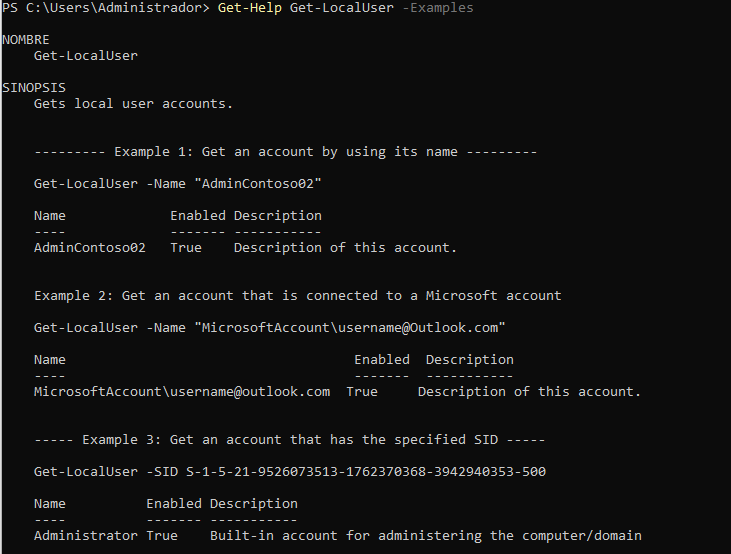

2. Obtén un listado de todos los comandos relacionados con la gestión de usuarios locales (es decir, con el nombre `LocalUser`).

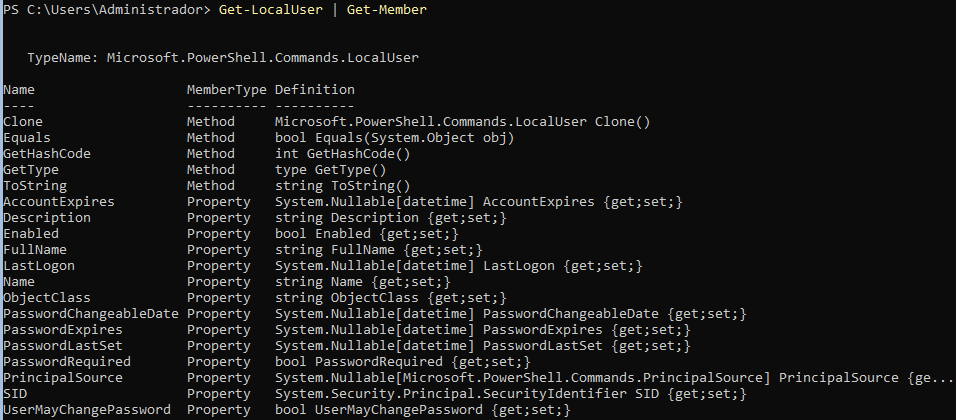

3. Utilizando la línea de comandos, muestra en el navegador la ayuda del comando `Get-LocalUser`.

Primero, actualizaremos la ayuda con `Update-Help`

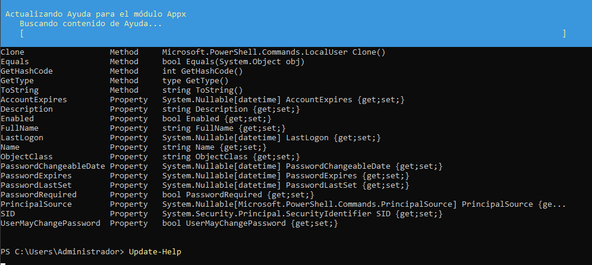

Luego, visualizamos la ayuda de `Get-LocalUser` con `Get-Help -Name Get-LocalUser`

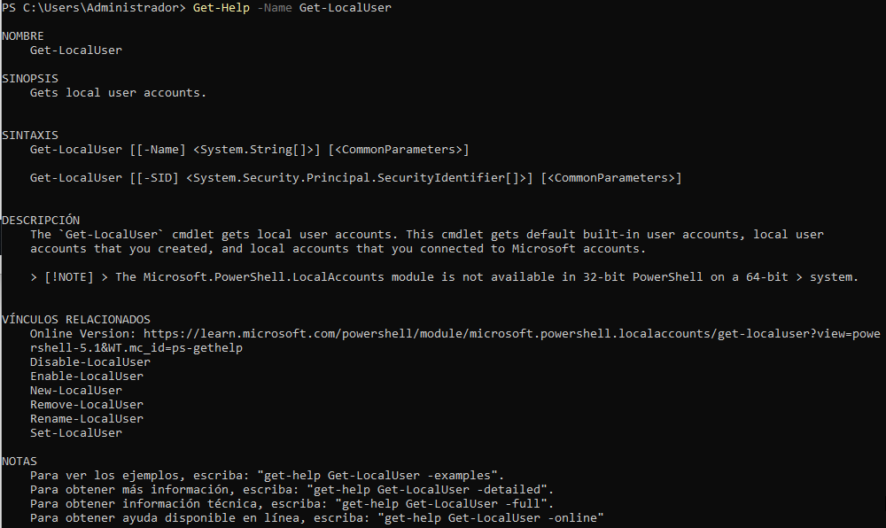

4. Averigua para qué sirve el comando `Set-Content` y explícalo brevemente con tus palabras.

Este comando sirve para escribir un contenido en un archivo, o sobreescribir un contenido ya existente. Simplemente asigna el contenido que le pongamos. Si ya hay un contenido, se sobreescribe, si no, simplemente se escribe.

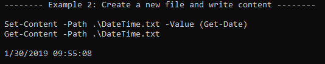

En este comando vemos que está asignando contenido al archivo **DateTime.txt**, el cual su valor es **Get-Date**, que obtendrá la hora actual. Si luego visualizamos el contenido con **Get-Content**, vemos la hora actual.

## ==================== WIP

5. Explica tres formas diferentes de ver o buscar un comando que hayas utilizado anteriormente en tu sesión.

   - La primera forma es usando las flechas arriba :arrow_up: y abajo :arrow_down: , que nos sirven para navegar entre los comandos que hemos introducido, de uno en uno.

   - La segunda forma es con `Get-History`, que nos muestra los comandos que hemos introducido de forma numerada. También podemos abrirlo con `h`:

    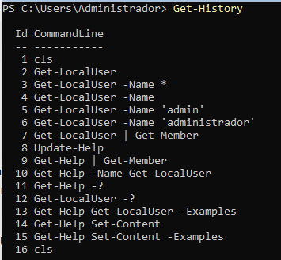

    Para volver a ejecutar el último comando introducido, podemos emplear `Invoke-History`. Si lo acompañamos de `-Id <numero>` podremos volver a ejecutar el comando de esa entrada. También podremos llamar a este comando con la tecla `r`.

   - La última forma es con Ctrl+R, que sirve para buscar un comando...
## Otra forma es con ??? =======

6. Averigua si el comando `Get-Process` tienen un parámetro llamado `ComputerName` y en caso afirmativo explica para qué sirve.

Comprobamos si existe el parámetro **ComputerName** ejecutando `Get-Help Get-Process -Parameter ComputerName`:

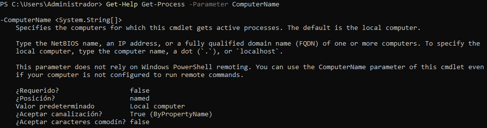

Sirve para especificar el equipo destino para el comando **Get-Process**, para buscar los procesos activos en ese equipo. Si no se pone nada, se buscará en nuestro equipo local.

7. Muestra la ayuda del comando `Start-VM` en una ventana emergente.

No nos permite realizar esta acción porque no encuentra el comando `Start-VM` en un archivo de ayuda, incluso después de ejecutar `Update-Help`. Aun así, el comando a ejecutar sería `Get-Help -Name Start-VM -ShowWindows`:

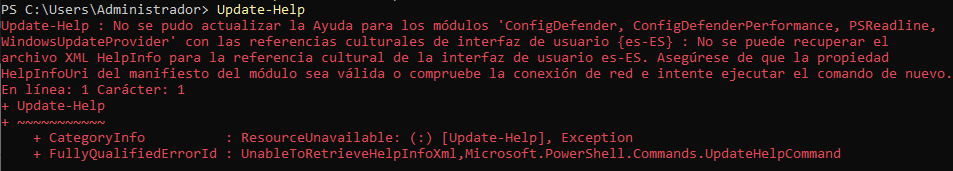
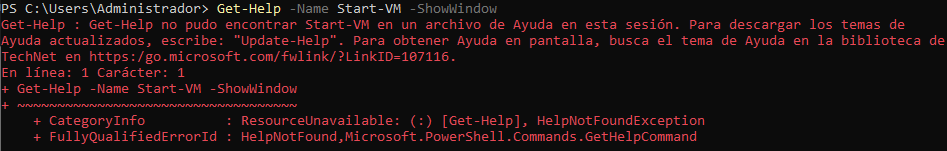

8. Muestra la ayuda del comando `Get-Help` en el navegador invocándolo desde la línea de comandos.

Esto lo haremos con `Get-Help -Name Start-VM -Online`

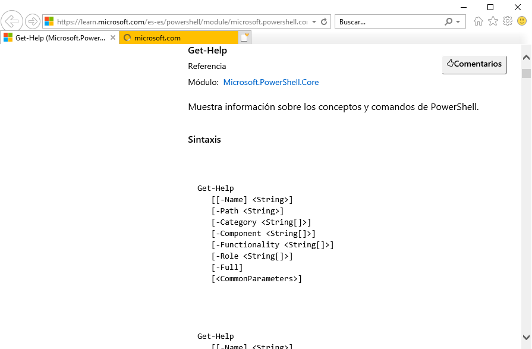

9.  Muestra las últimas 20 entradas del historial.

Esto lo haremos mediante `Get-History -Count 20`:

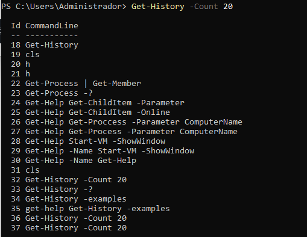

10. Elimina las entradas 10, 12 y 14 de tu historial.

Esto lo haremos con `Clear-History -Id 10, 12, 14`

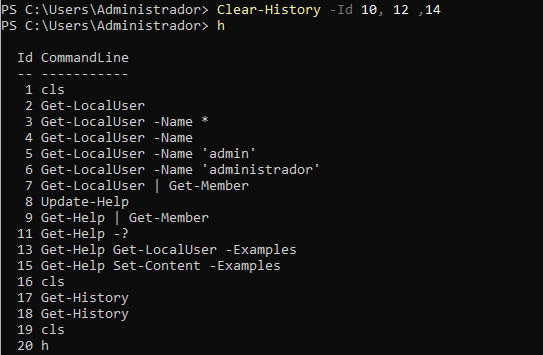