# PR0402: Introducción a Powershell (II)

[Enlace al enunciado](https://github.com/vgonzalez165/apuntes_aso/blob/main/ut04/practicas/pr0402_introducci%C3%B3n_powershell_ii.md)

[Volver al Índice](../../index.md)

Realiza las siguientes tareas que se te piden utilizando Powershell. Para contestar lo mejor es que hagas una captura de pantalla donde se vea el comando que has introducido y las primeras líneas de la salida de este.

1. Visualiza las últimas cinco entradas del historial, mostrando para cada una el comando, la hora en que finalizó su ejecución y el estado de ejecución.

Esto lo haremos con `Get-History -Count 5 | Format-List -Property *`

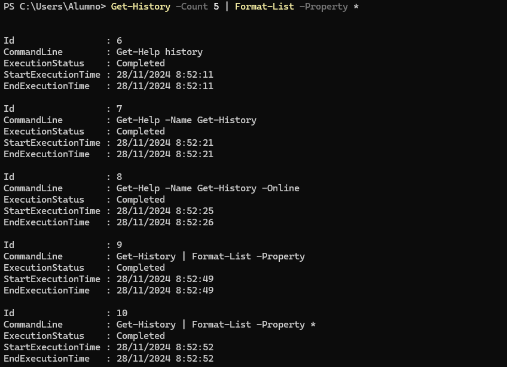

2. Ejecuta el comando `Get-Command` (que muestra todos los comandos disponibles en Powershell) e interrúmpelo antes de que finalice su ejecución pulsando las teclas Ctrl-C. A continuación, ejecútalo dejando que finalice correctamente.

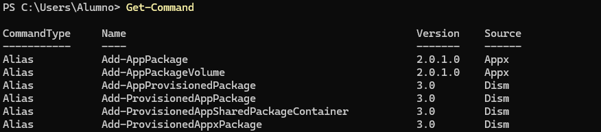

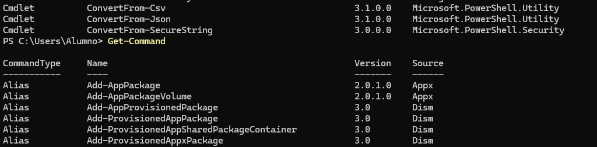

3. Vuelve a ejecutar el comando del punto 1 y comprueba las diferentes salidas de finalización de estado de ejecución.

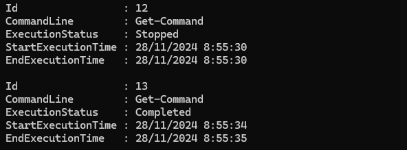

4. Muestra todos los procesos con el nombre `msedge` mostrando para cada uno el identificador, el consumo de CPU y los hilos (*threads*)

Lo hacemos con el comando `Get-Process -Name msedge | Select-Object Name,CPU,threads`:

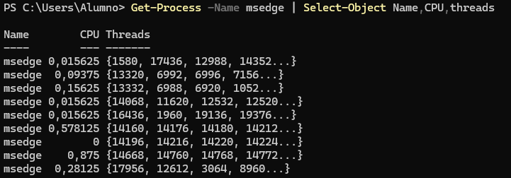

5. Averigua para qué sirve el parámetro `-Delimiter` del comando `Export-CSV`

El parámetro `-Delimiter` sirve para especificar el caracter con el que se van a separar los datos del archivo que nos va a exportar. El formato de este archivo, por defecto es es "dato1","dato2","dato3", separado por comas. Podemos separarlo por distintos símbolos, como `:` o `;`.

6. Muestra en una ventana la ayuda del comando `Get-History`

Lo hacemos con `Get-Help -Name Get-History -ShowWindow`

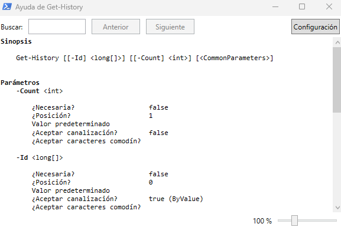

7. Muestra un listado con todos los comandos que tengan el verbo `Update`.

Esto lo hacemos con  `Get-Command | Where-Object Name -like Update-*`

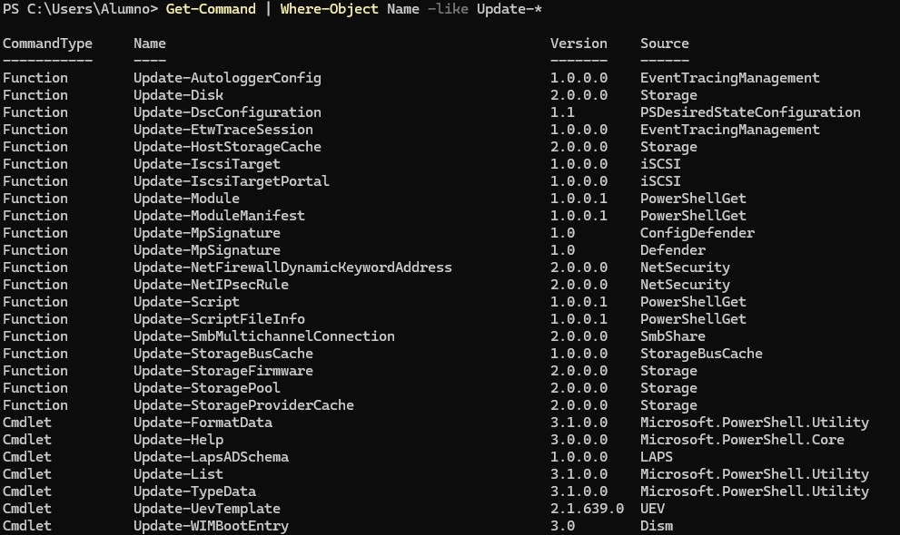

8. Ejecuta la herramienta **Recortes** y localízala usando el comando `Get-Process` teniendo en cuenta que el proceso se llama `SnippingTool.exe` 

No me aparecía `SnippingTool.exe`, sino sólamente `SnippingTool`, mediante `Get-Process -Name SnippingTool`

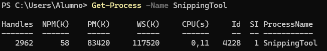

9. Averigua qué propiedades tienen los procesos devueltos con el comando `Get-Process`.

Esto lo podemos hacer con `Get-Process | Get-Member`:

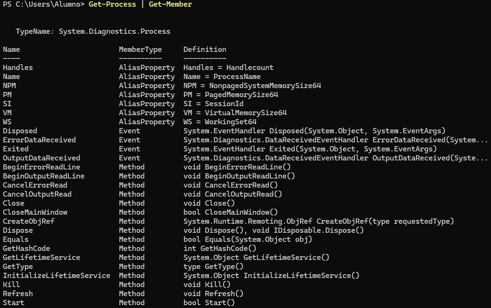

10.  Busca en la ayuda para qué sirve el parámetro `-MemberType` del comando `Get-Member`.

Sirve para obtener información sobre un determinado tipo de miembro, que puede ser **NoteProperty**, **AliasProperty**, **ScriptProperty**, **CodeProperty**...

11.  Desde la línea de comandos, finaliza la ejecución de la herramienta **Recortes**.

Esto lo hacemos con `Get-Process SnippingTool | Stop-Process`

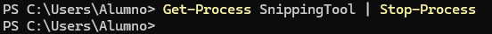

12.   Muestra todos los procesos que tienen el nombre `svchost`.

Lo hacemos con `Get-Process svchost`

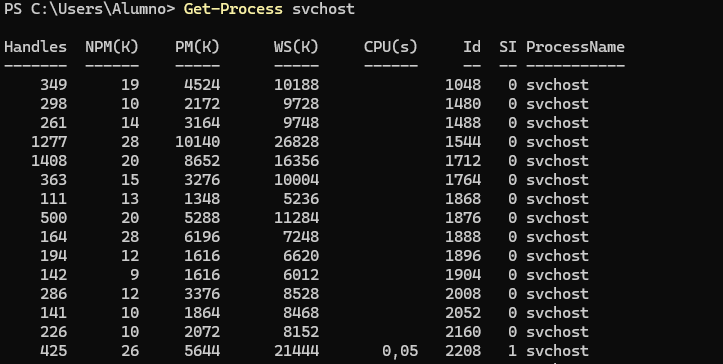

13.  Muestra por pantalla el número de instancias del proceso `svchost`.

Esto lo podemos hacer con `Get-Process svchost | Group-Object -Property SI`, para que los agrupe por esa columna, que puede ser 0 o 1.

Nos cuenta 76 instancias en 0 y 8 en 1, por lo que tenemos 84 instancias en total.

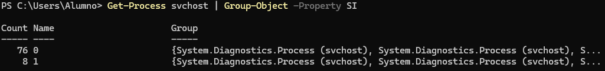

14.  Muestra por pantalla todos los procesos con el nombre `svchost` mostrando para cada uno: nombre, identificador, hora de inicio, tiempo total de procesador y clase de prioridad. Se deben mostrar de **forma tabular**.

Esto se puede hacer con `Get-Process svchost | Select-Object Name,Id,StartTime,TotalProcessorTime,PriorityClass | Format-Table`:

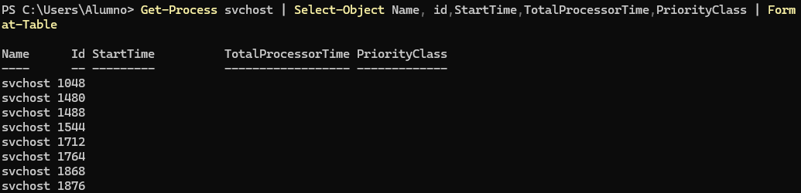

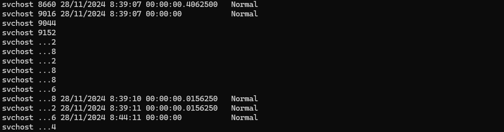

15.   Repite la búsqueda anterior, pero ordenando por el campo tiempo total de procesador en sentido descendente.

Esto se puede hacer con `Get-Process svchost | Select-Object Name,Id,StartTime,TotalProcessorTime,PriorityClass | Sort-Object TotalProcessorTime -Descending | Format-Table`:

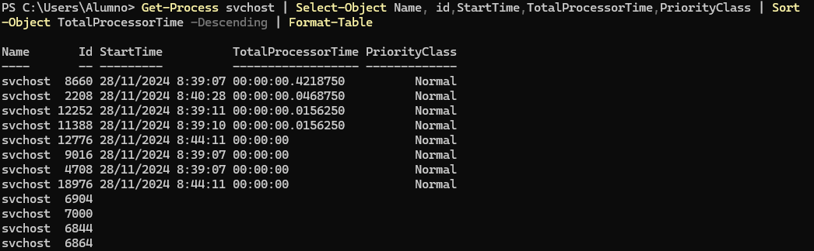

16. Muestra los usuarios que hay en el sistema agrupándolos por la propiedad `Enabled`.

Esto lo podemos hacer con `Get-LocalUser | Group-Object Enabled`:

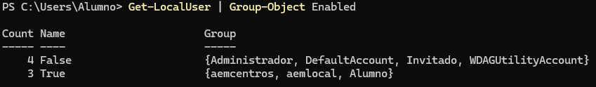

17. Muestra los usuarios que hay en el sistema con la cuenta habilitada (propiedad `Enabled` puesta a `True`). Utiliza el filtrado con el comando `Where-Object`

Esto lo hacemos con `Get-LocalUser | Where-Object Enabled -eq True`:

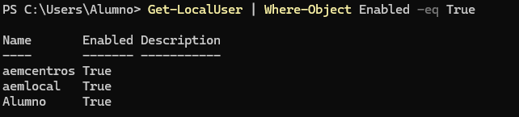

18. Muestra un listado de todos los usuarios del sistema con el nombre y la fecha de la última vez que iniciaron sesión (tienes que buscar la propiedad que indique último inicio de sesión o *last logon*)

La propiedad de last logon se llama `LastLogon`, obtenida empleando el `Get-Member` junto a `Get-LocalUser`.

El comando quedará `Get-LocalUser | Select-Object Name,LastLogon`

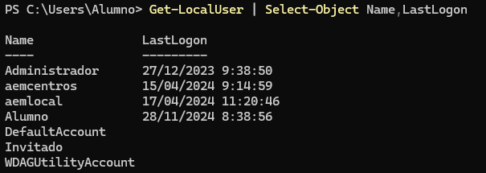