# PR0404: Administración remota del servidor

En esta práctica vamos a complementar lo que hicimos en clase el otro día preparando la administración remota de un servidor en modo Core.

## 1.- Entorno virtualizado

Necesitarás la siguiente configuración de máquinas virtuales:
- **Windows Server 2019 con experiencia de escritorio** (debes utilizar el que ya tienes preparado del otro día)
- **Windows Server 2016 en modo Core**, este equipo tendrá dos adaptadores de red, uno en modo NAT y otro en modo solo-anfitrión

Vamos a aprovechar la misma red que preparamos el otro día (`172.25.0.0/16`) para añadir el nuevo equipo a la misma a través de su adaptador en modo solo-anfitrión.

  Para este paso, añado un Adaptador de Red en modo solo-anfitrión en la máquina de VirtualBox que he creado para el Windows Server 2016 en modo Core:
    

## 2. Preparación de las máquinas

- **Añade el nuevo equipo a la red**, *comprueba que tiene visibilidad* con los tres equipos que ya tienes en ella (las dos máquinas virtuales y el equipo anfitrión)
    
    Teniendo el adaptador sólo anfitrión en nuestro Server 2016, vamos a configurar su IP para añadirlo a la red. Primero identifico la interfaz de red para asignarle una IP estática, y luego desactivo todos los perfiles en el cortafuegos:

    

    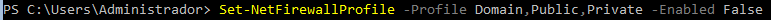

    **Conexiones desde CORE-2016:**
    -  Hacia AYA-2019:
  
        

    -  Hacia AYA-CORE-2019:
  
        

    - Hacia equipo HOST:

        

    **Conexiones hacia CORE-2016:**
    - Desde AYA-2019:

        

    - Desde AYA-CORE-2019:

        

    - Desde equipo HOST:

        

- Asigna **nombres a los equipo**, estos nombres serán:
  - Windows Server 2019 con entorno gráfico: `{INICIALES}-2019` - `IP: 172.25.0.61`:
    
  - Windows Server 2019 en modo core: `{INICIALES}-CORE-2019` - `IP: 172.25.0.62`:
    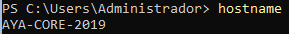
  - Windows Server 2016 en modo core: `{INICIALES}-CORE-2016` - `IP: 172.25.0.63`:
    

## 3. Configuración del acceso remoto al nuevo equipo

- Realiza los pasos necesarios para poder utilizar **PowershellDirect** sobre el nuevo equipo desde el servidor principal (el que tiene entorno gráfico)

    En **AYA-2016-CORE** activamos PSRemoting con `Enable-PSRemoting -Force`
    
    

    Ahora, en **AYA-2019** añadimos el **AYA-2016-CORE** a la lista de TrustedHosts, mediante `Set-Item WSMan:\localhost\Client\TrustedHosts -Value "172.25.0.62,172.25.0.63"`, con las direcciones separadas por comas para no perder la configuración que teníamos antes:

    

- Asegúrate de que sigas pudiendo administrar el otro equipo en modo Core
- Para comprobarlo, crea de forma remota en ambos equipo en modo Core un usuario con privilegios de administrador llamado `{iniciales}`. Si no sabes cómo hacerlo tienes una breve guía [aquí](https://intelaf.wordpress.com/2022/08/12/como-crear-usuario-administrador-desde-powershell-en-windows-11/)

    ### Comprobación hacia AYA-2016-CORE:

    

    ### Comprobación hacia AYA-2019-CORE:

    

## 4. Configuración del acceso remoto sobre HTTPS

- Una vez que hayas comprobado que tienes todo bien configurado es el momento de asegurar nuestra red preparándola para que utilice **WinRM sobre HTTPS** utilizando un certificado autofirmado.

#### 4.1. Creación del certificado autofirmado

Desde Windows 2016 Core, ejecuto lo siguiente:
    `New-SelfSignedCertificate -DnsName "172.25.0.63" -CertStoreLocation Cert:\LocalMachine\My -KeyLength 2048`:

#### 4.2. Configuración del listener
Desde Windows 2019 Server con escritorio, primero eliminaré el listener HTTP con `Remove-Item -Path WSMan:\localhost\Listener\Listener* -Recurse`

Ahora, voy a buscar el **hash** del certificado que hemos creado antes, mediante `Get-ChildItem -Path Cert:\LocalMachine\My`

Para a continuación crear el nuevo listener con `New-Item -Path WSMan:\localhost\Listener -Transport HTTPS -Address * -CertificateThumbPrint 617AC0C75799EBA5FB80C780EF0DB53612189C4C`

También, vamos a asegurarnos de que el puerto **5986** esté abierto en el firewall con `netsh advfirewall firewall add rule name="WinRM HTTPS" protocol=TCP dir=in localport=5986 action=allow`

#### 4.3. Verificando la configuración

Con `winrm enumerate winrm/config/Listener` comprobaremos que el listener se ha configurado correctamente:

#### 4.4. Configurar el cliente para usar HTTPS.

Para configurar correctamente el cliente, tendremos que exportar el certificado SSL que hemos creado en **AYA-2016-CORE**, lo cual podemos realizar con `Export-Certificate -Cert Cert:\LocalMachine\My\617AC0C75799EBA5FB80C780EF0DB53612189C4C -FilePath C:\ayacert.cer`

Ahora tendremos que mover este certificado a la máquina **desde la que nos conectamos**, para después importarlo a nuestros certificados:

Al intentar conectarnos desde **AYA-2019** a **AYA-2016-CORE** mediante HTTPS, ya nos deja realizar la conexión:

- Realiza los pasos necesarios para que la comunicación con ambos servidores utilice este mecanismo.

(Repetir para **AYA-2019-CORE**)

Vamos a hacer los mismos pasos para configurar **AYA-2019-CORE**. Desde esta máquina, ejecutamos:

Creo el certificado:

Elimino el listener HTTP:

Configuro el nuevo listener HTTPS:

Aseguramos que tenemos el puerto 5986 abierto:

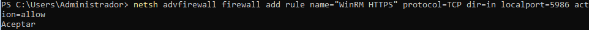

Comprobamos que el listener está bien configurado:

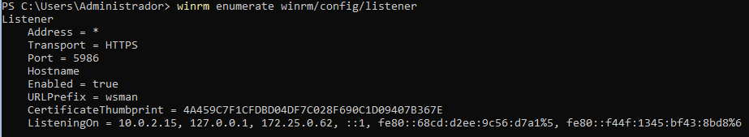

Exporto el certificado creado:

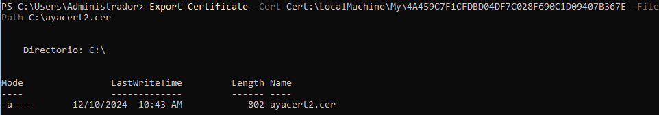

Copio el certificado a **AYA-2019-CORE** y lo importo:

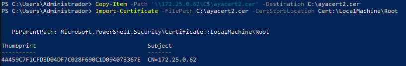

Al intentar la conexión, nos la permite sin problemas:

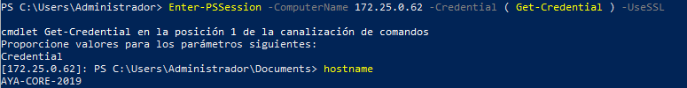

## 5. Configuración remota con Windows Admin Center

- Por último, configura tus equipos para poder administrarlos de forma remota utilizando **Windows Admin Center** desde el equipo con entorno gráfico.

Lo primero que haré para realizar esto será desactivar la configuración de seguridad de Internet Explorer para que no nos moleste al descargar WAC. Para ello nos vamos al **Administrador del servidor** > **Servidor local** > **Configuración de seguridad mejorada de IE**:

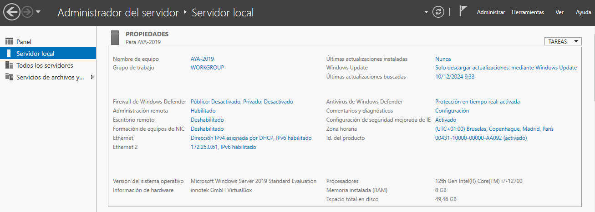

Marcamos las casillas de **Desactivado** y pulsamos en **Aceptar**:

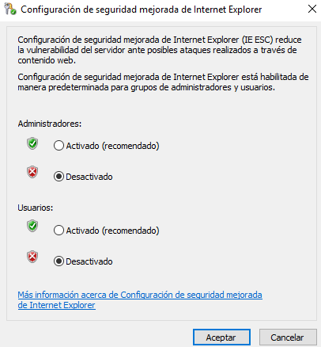

Ya podremos acceder cómodamente a https://www.microsoft.com/es-es/windows-server/windows-admin-center para descargar Windows Admin Center:

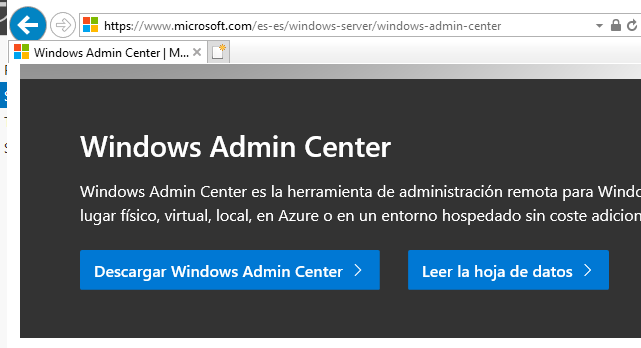

Cuando esté descargado, lo instalamos, y cuando finalice, ya podremos acceder a la herramienta desde un navegador. Con Internet Explorer no podremos acceder porque es demasiado antiguo, así que lo haremos con Microsoft Edge desde otra máquina virtual con Windows 10 en la misma red:

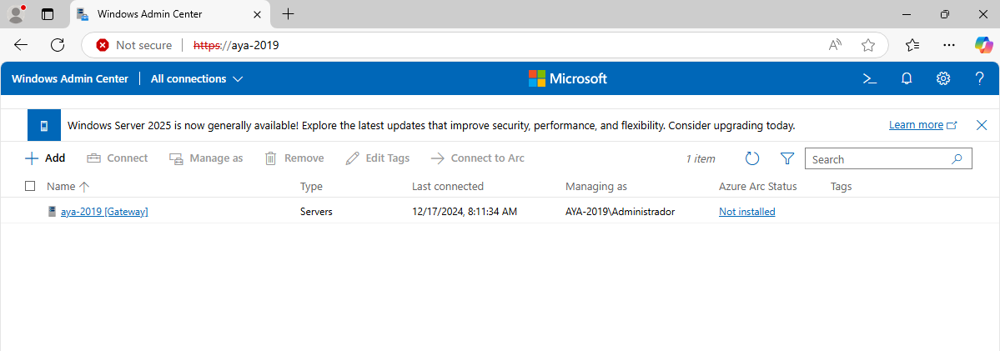

Para añadir los servidores en modo core, primero tenemos que pasar el instalador a estos equipos, con la opción `Copy-Item`, por ejemplo:

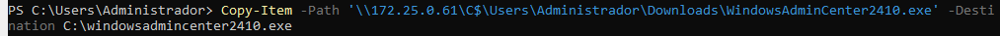

## 6. Documentación

Como es habitual, tienes que documentar los pasos más relevantes que has seguido para realizar la práctica.