# PR0501: Carpetas personales y compartidas por un grupo

[Enlace al enunciado](https://github.com/vgonzalez165/apuntes_aso/blob/main/ut05/practicas/pr0501_carpetas_personales.md)

[Volver al Índice](../../index.md)

Realiza los siguiente pasos en tu dominio:

## Creación de usuarios y grupos

- Crea en tu dominio los usuarios `aperez` y `fgonzalez`.

Primero, nos dirigimos al Administrador del Servidor > Herramientas > Usuarios y Equipos de Active Directory

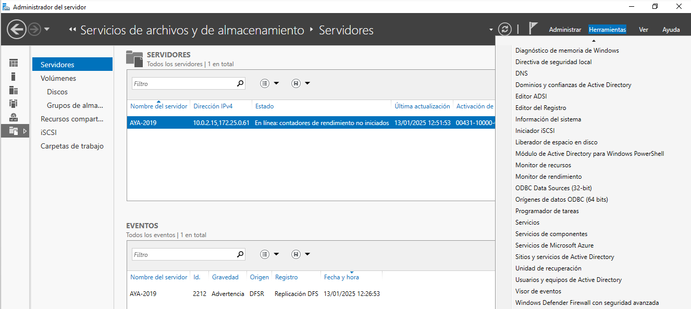

Seleccionamos y desplegamos el panel de nuestro domino **aya.local** > Botón derecho sobre la carpeta **Users** > Nuevo > Usuario. (contraseña **Passw0rd**)

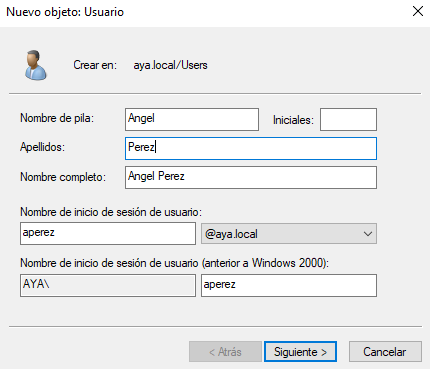

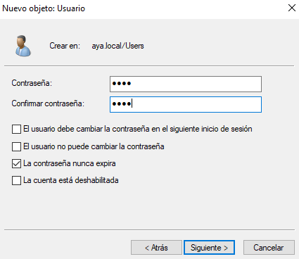

Realizamos lo mismo para el usuario `fgonzalez`

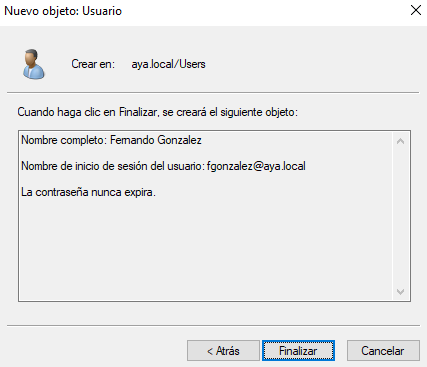

- Crea un grupo global denominado `alumnos` y agrega los usuarios que creaste anteriormente.

Volvemos a **Usuarios y equipos de Active Directory** > Pulsamos botón derecho sobre la carpeta **Users** > Nuevo > Grupo:

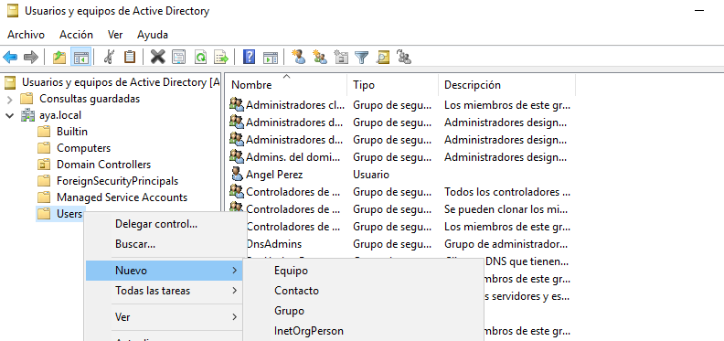

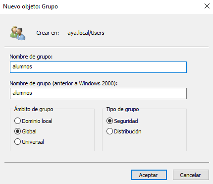

Para añadir nuestros nuevos usuarios al grupo **alumnos**, hacemos click derecho sobre cada usuario y pulsamos en **Agregar a un grupo...**:

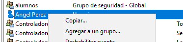

En el cuadro de texto escribimos **alumnos**, pulsamos en **Comprobar nombres** y se nos autocompletará el grupo que hemos creado. Pulsamos en **Aceptar**.

Haremos lo mismo con el **fgonzalez**:

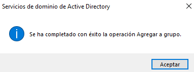

## Carpetas personales

- Instala el *Administrador de recursos del servidor de archivos* que está dentro del rol *Servicios de archivos y almacenamiento*

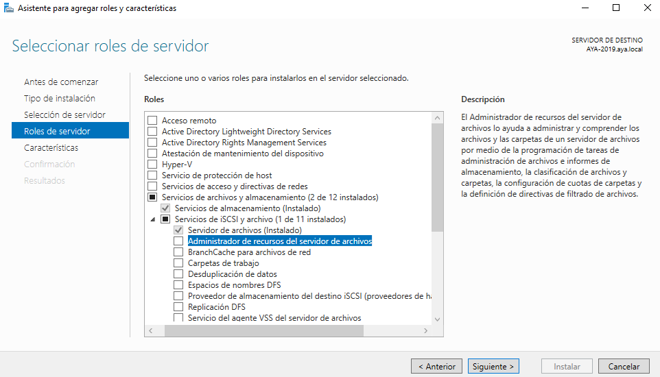

- Utilizando la herramienta *Servicios de archivos y de almacenamiento* del *Administrador del servidor*, crea una carpeta para cada usuario dentro de `C:\shares` y realiza los pasos necesarios para que ambos usuarios puedan ver esta carpeta como una unidad de red identificada con la letra `H:`

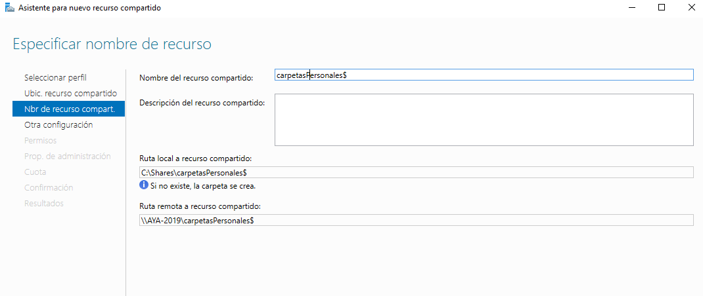

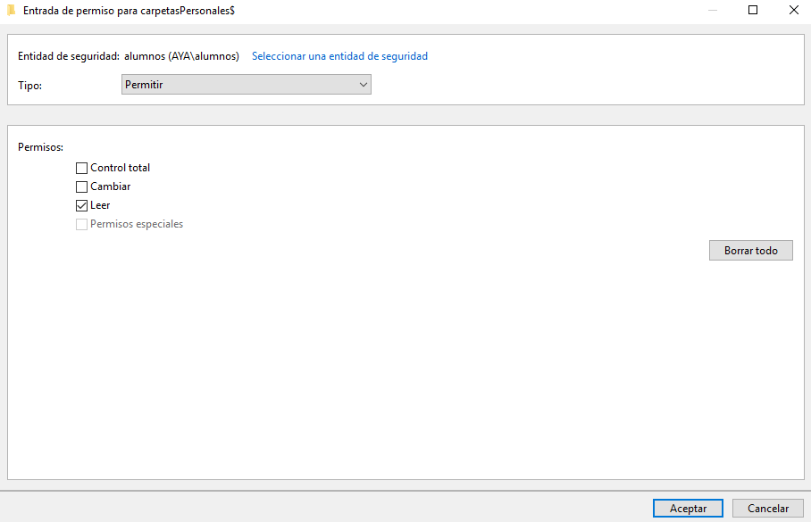

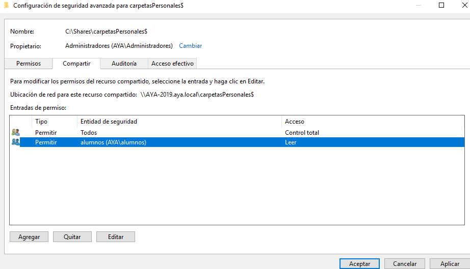

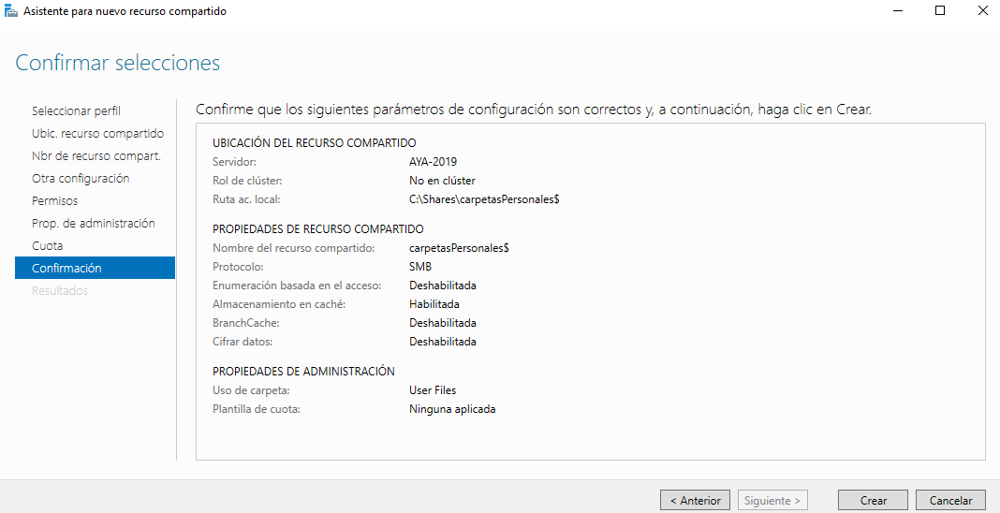

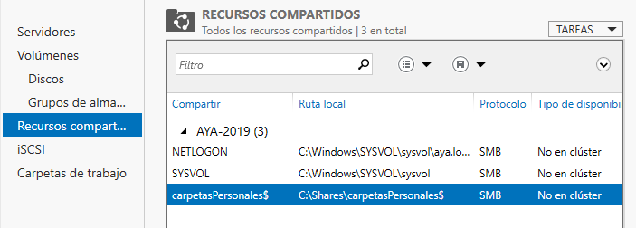

- Comprueba que la carpeta de cada usuario solo pueda ser accedida por él mismo.

Para comprobar esto, voy a unir un equipo cliente al Dominio, para lo cual primero añadiré un Equipo nuevo al Administrador del dominio:

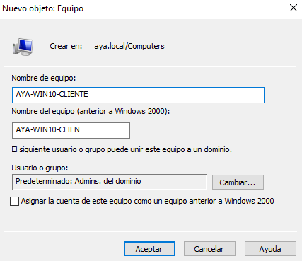

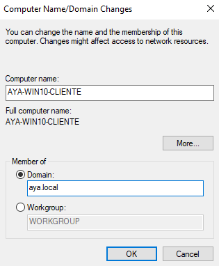

## Carpetas compartidas por un grupo

- Crea en `C:\shares` una carpeta llamada `apuntes` y realiza las tareas necesarias para que los usuarios del grupo `alumnos` puedan acceder a ella como un espacio de almacenamiento compartido.

USAR RECURSOS COMPARTIDOS, ROL SERVICIOS DE ARCHIVOS Y ALMACENAMIENTO > Administrador de recursos del servidor de archivos (2º opctión)

## Entrega de la tarea

Debes documentar los pasos más relevantes de la misma y entregarla en el repositorio.
