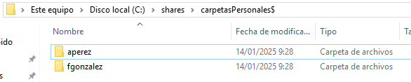

# PR0501: Carpetas personales y compartidas por un grupo

[Enlace al enunciado](https://github.com/vgonzalez165/apuntes_aso/blob/main/ut05/practicas/pr0501_carpetas_personales.md)

[Volver al Índice](../../index.md)

Realiza los siguiente pasos en tu dominio:

## Creación de usuarios y grupos

- Crea en tu dominio los usuarios `aperez` y `fgonzalez`.

Primero, nos dirigimos al Administrador del Servidor > Herramientas > Usuarios y Equipos de Active Directory

Seleccionamos y desplegamos el panel de nuestro domino **aya.local** > Botón derecho sobre la carpeta **Users** > Nuevo > Usuario. (contraseña **Passw0rd**)

Realizamos lo mismo para el usuario `fgonzalez`

- Crea un grupo global denominado `alumnos` y agrega los usuarios que creaste anteriormente.

Volvemos a **Usuarios y equipos de Active Directory** > Pulsamos botón derecho sobre la carpeta **Users** > Nuevo > Grupo:

Para añadir nuestros nuevos usuarios al grupo **alumnos**, hacemos click derecho sobre cada usuario y pulsamos en **Agregar a un grupo...**:

En el cuadro de texto escribimos **alumnos**, pulsamos en **Comprobar nombres** y se nos autocompletará el grupo que hemos creado. Pulsamos en **Aceptar**.

Haremos lo mismo con el **fgonzalez**:

## Carpetas personales

- Instala el *Administrador de recursos del servidor de archivos* que está dentro del rol *Servicios de archivos y almacenamiento*

- Utilizando la herramienta *Servicios de archivos y de almacenamiento* del *Administrador del servidor*, crea una carpeta para cada usuario dentro de `C:\shares` y realiza los pasos necesarios para que ambos usuarios puedan ver esta carpeta como una unidad de red identificada con la letra `H:`

Primero creo la carpeta compartida desde **Servicios de archivos y de almacenamiento > Recursos compartidos**

Agrego permisos de Lectura para el grupo **alumnos** y dejo el control total para los miembros del dominio:

Ya veremos nuestra carpeta creada:

Vamos a editar sus permisos para eliminar el acceso para el grupo Usuarios, para que no puedan ver la carpeta de otros usuarios o la carpeta raíz:

Añadiendo carpetas a la unidad de Red de cada usuario:

Ruta: ``\\AYA-2019\carpetasPersonales$\%username%``

### Resultado:

- Comprueba que la carpeta de cada usuario solo pueda ser accedida por él mismo.

Para comprobar esto, voy a unir un equipo cliente al Dominio, para lo cual primero añadiré un Equipo nuevo al Administrador del dominio:

Acto seguido, uno el Cliente al dominio desde  **About your PC** > **Rename this PC (advanced)** > **Change**

Al iniciar sesión con uno de los usuarios del dominio, veremos la carpeta en la unidad H:.

## Carpetas compartidas por un grupo

- Crea en `C:\shares` una carpeta llamada `apuntes` y realiza las tareas necesarias para que los usuarios del grupo `alumnos` puedan acceder a ella como un espacio de almacenamiento compartido.

aperez y fgonzalez son miembros del grupo **alumnos**:

Creo una carpeta compartida, con nombre datos:

Añadmos permisos para el grupo **Usuarios**:

Creamos eun script en ``\\localhost\NETLOGON``:

Creamos un .bat con contenido:
`net use X: \\172.25.0.61\datos`

Ahora haremos que se ejecute cada vez que un usuario inicie sesión. Seleccionamos ambos usuarios en **Usuarios y grupos de Active Directory**, y accedemos a sus propiedades:

No hace falta indicar la ruta completa porque el script ya se encuentra en NETLOGON.

Al cerrar sesión e iniciarla de nuevo, veremos los cambios que hemos realizado:

## Desde fgonzalez:

Podemos acceder a la carpeta de usuario `fgonzalez`, también a la de **datos** pero no a la de `aperez`:

## Desde aperez:

Podemos acceder a la carpeta de usuario `aperez`, también a la de **datos**, pero no a la carpeta personal de ``fgonzalez``:

