# PR0502: Aplicación de directivas

[Enlace al enunciado](https://github.com/vgonzalez165/apuntes_aso/blob/main/ut05/practicas/pr0502_aplicacion_gpos.md)

[Volver al Índice](../../index.md)

Eres el administrador de sistemas de una empresa que cuenta con las siguientes características:

- Dominio: `techworld.local`
- Unidades Organizativas:
    - `Usuarios`: contiene los usuarios del dominio, divididos en dos UO:
        - `management`.
        - `development`.
    - `Equipos`: Contiene los equipos de los empleados.

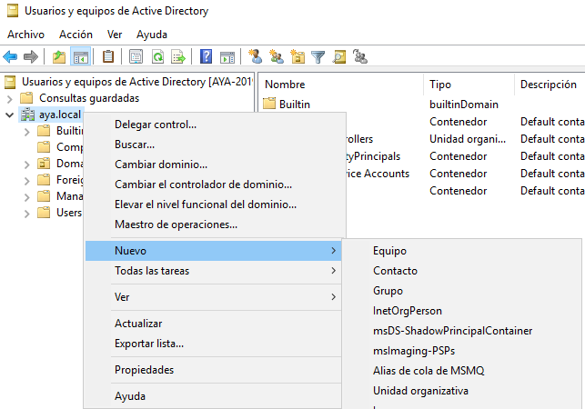

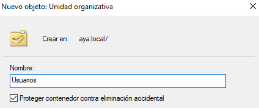

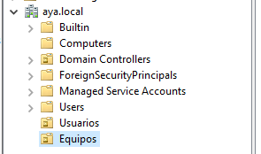

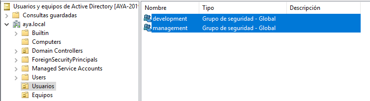

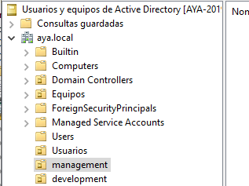


## Requisitos

### Directiva 1

- **Directiva**: No se puede cambiar el fondo de pantalla del escritorio (`Configuración de usuario -> Plantillas administrativas -> Escritorio`)
- **A quienes se aplica**: a los usuarios del grupo `management`

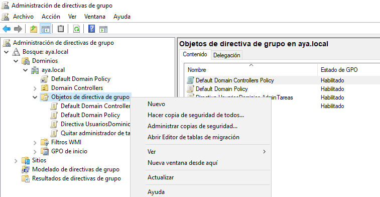

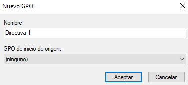

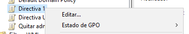

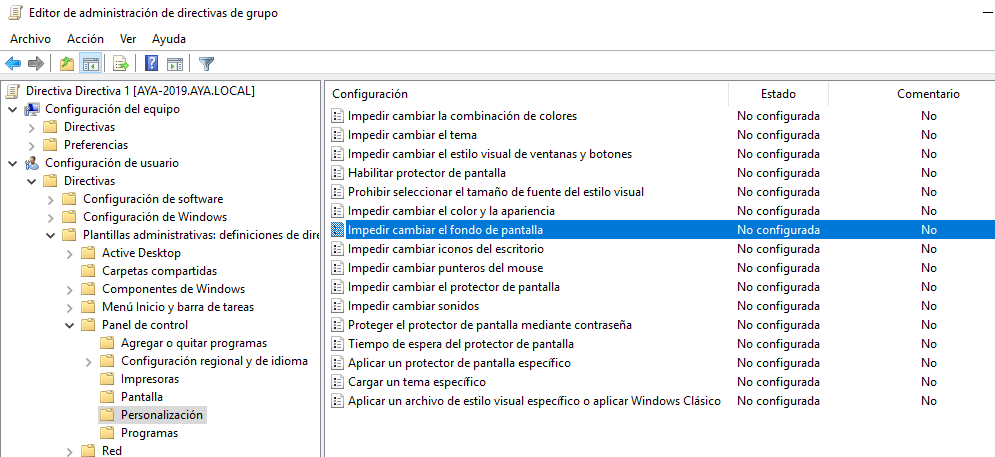

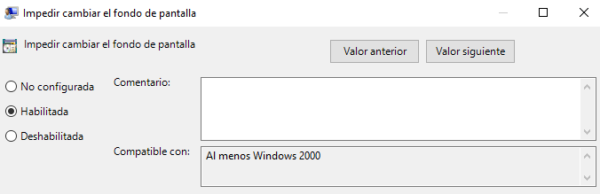

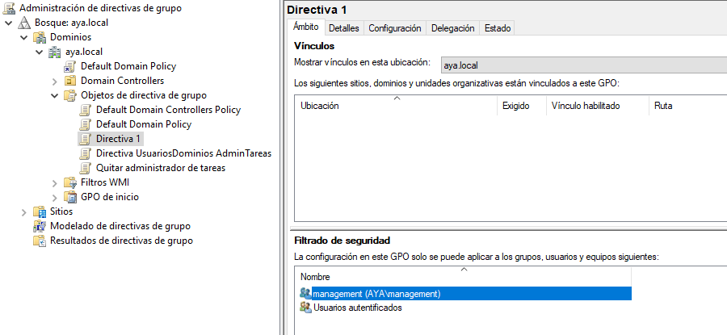


### Directiva 2

- **Directiva**: se pueden ejecutar scripts de Powershell sin restricciones (`Configuración de equipo -> Plantillas administrativas -> Componentes de Windows -> Windows Powershell`).
- **A quienes se aplica**: a los usuarios del grupo `development`

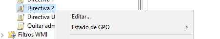

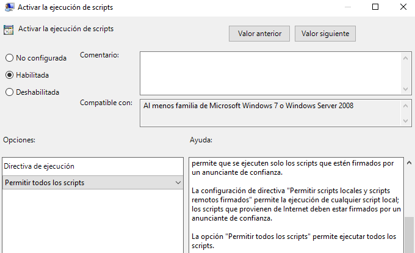

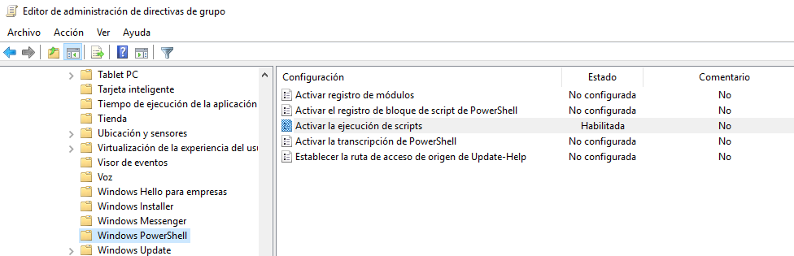

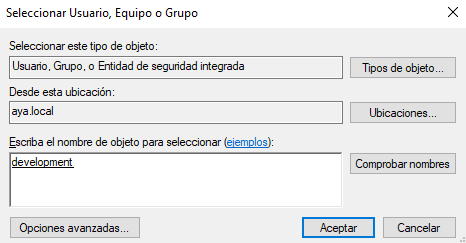

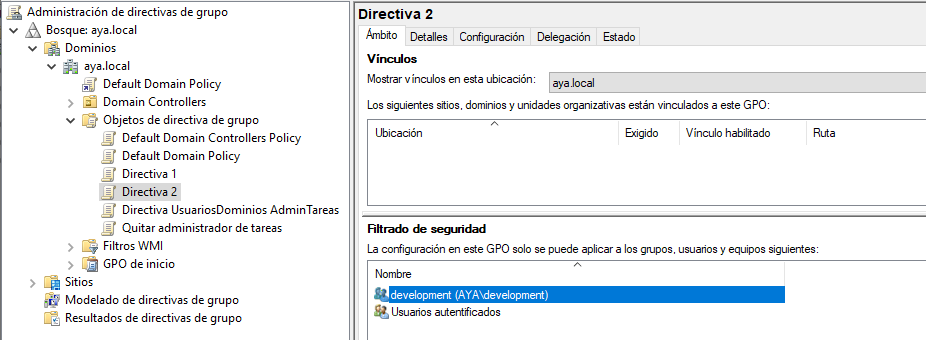


### Directiva 3

- **Directiva**: el firewall de Windows está habilitado (`Configuración de equipo -> Directivas -> Configuración de Windows -> Configuración de seguridad -> Windows Defender Firewall -> Perfil del dominio`)
- **A quienes se aplica**: todos los equipos del dominio
- **Excepciones**: esta directiva no debe aplicarse a un equipo específico denominado `DEV-PC1`

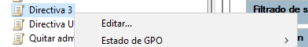

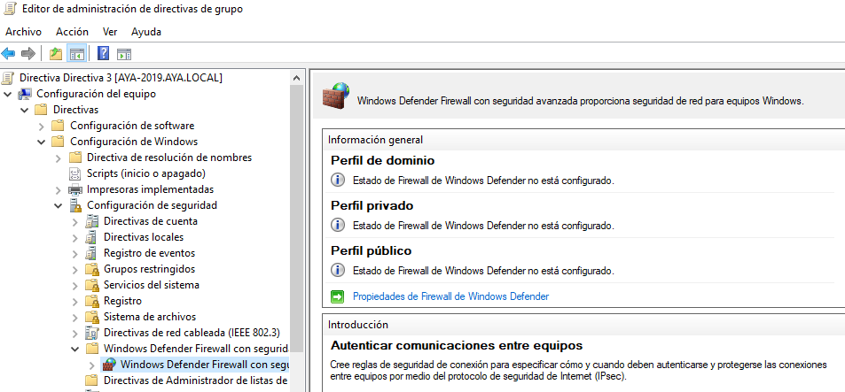

En propiedades:

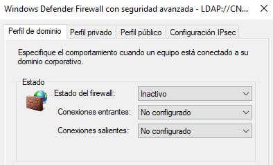

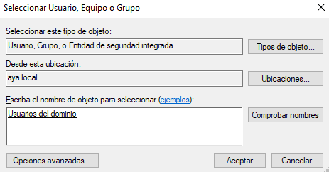

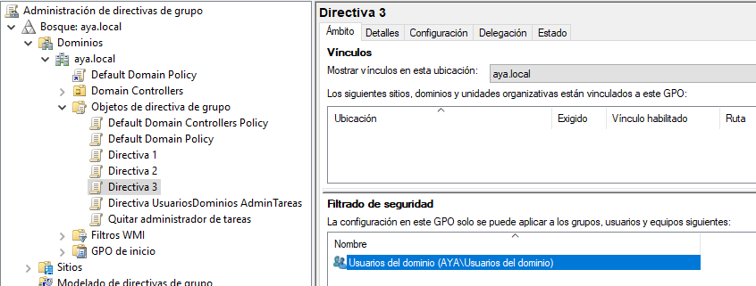

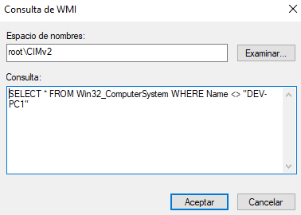


```
select * from Win32_ComputerSystem where Name <> "DEV-PC1"
```

### Directiva 4

- **Directiva**: configura las actualizaciones para que se descarguen automáticamente y se instalen fuera del horario laboral (`Configuración de equipo -> Directivas -> Plantillas administrativas -> Componentes de Windows -> Windows Update -> Configurar actualizaciones automáticas`)
- **A quienes se aplica**: a todos los equipos del dominio

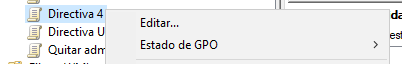


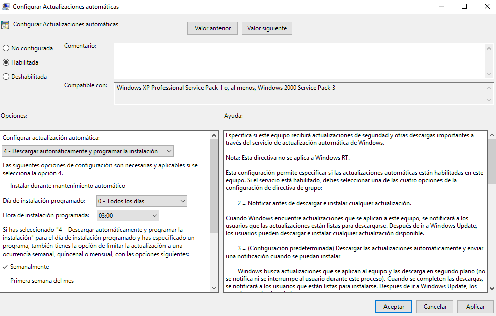

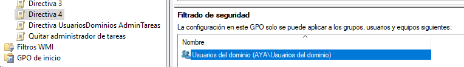


### Directiva 5

- **Directiva**: desactivar el acceso de lectura y escritura a dispositivos USB (`Configuración de equipo -> Directivas -> Plantillas administrativas -> Sistema -> Acceso de almacenamiento extraíble`)
- **A quienes se aplica**: a todos los equipos del dominio

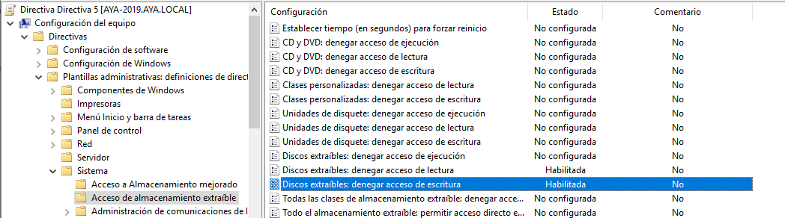


### Directiva 6

- **Directiva**: el usuario no podrá repetir ninguna de las 10 últimas contraseñas-
- **A quienes se aplica**: a todos los usuarios del dominio
- **Excepciones**: habrá dos usuarios en el dominio llamados `mgmt_director` y `dvlp_directo`, que pertenecen a las UO `management` y `development` respectivamente que no podrán repetir ninguna de las 2 últimas contraseñas.

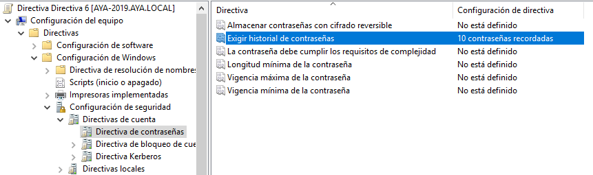

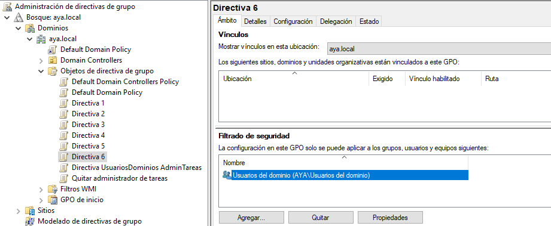

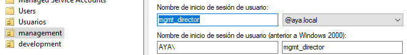

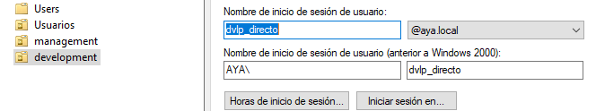

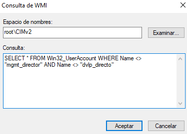

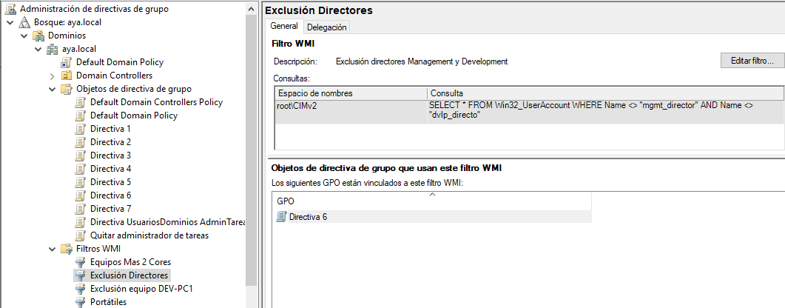

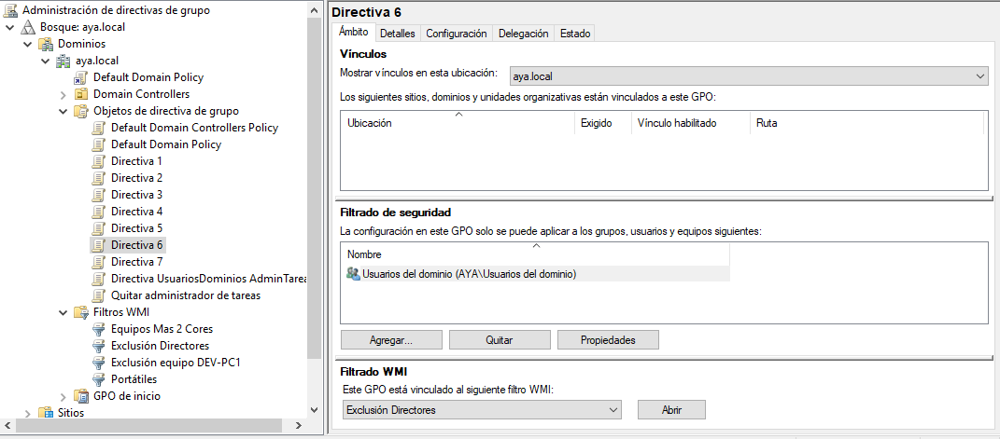

```

```


### Directiva 7

- **Directiva**: especifica que los equipos portátiles pasen a hibernación después de 30 minutos de inactividad (`Configuración de equipo -> Plantillas administrativas -> Sistema -> Administración de energía`)
- **A quienes se aplica**: a los equipos portátiles, por lo que tendrás que utilizar un **filtro WMI** (necesitarás la clase [`Win32_Battery`](https://powershell.one/wmi/root/cimv2/win32_battery))

```powershell
# get number of batteries:
$count = @(Get-CimInstance -ClassName Win32_Battery).Count
"Installed batteries: $count"

# test for battery:
$hasBattery = @(Get-CimInstance -ClassName Win32_Battery).Count -gt 0
"Has battery: $hasBattery"
```

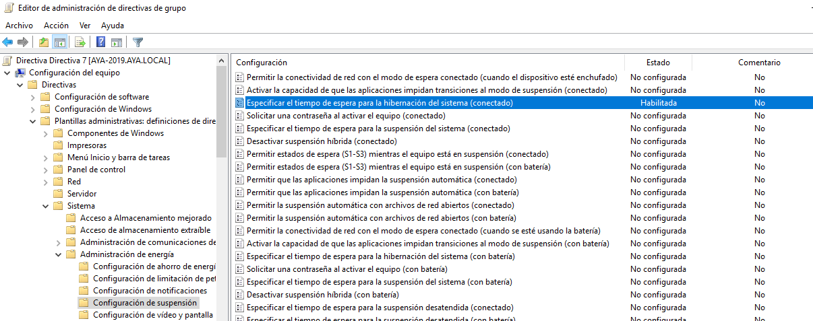

Habilitada configurada para 1800 segundos

Filtro WMI:


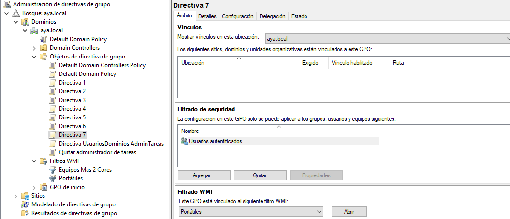