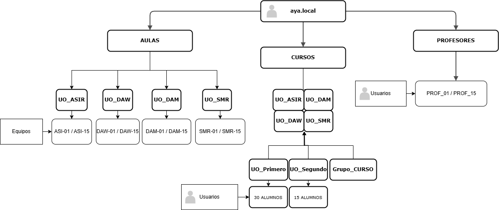

# Documentación Proyecto 2ª Evaluación - Asier Yusto Abad

## Índice
- [Documentación Proyecto 2ª Evaluación - Asier Yusto Abad](#documentación-proyecto-2ª-evaluación---asier-yusto-abad)
  - [Índice](#índice)
  - [1. Configuración del dominio](#1-configuración-del-dominio)
    - [1.1. Estructura del dominio](#11-estructura-del-dominio)
    - [1.2. Aplicación de GPOs](#12-aplicación-de-gpos)
    - [1.3. Implementación del dominio](#13-implementación-del-dominio)
  - [2. Archivos con los datos](#2-archivos-con-los-datos)
    - [2.1. `uo.csv`:](#21-uocsv)
    - [2.2. `alumnos.csv`:](#22-alumnoscsv)
  - [3. Scripts](#3-scripts)
    - [3.1. `scriptUO.ps1`](#31-scriptuops1)
      - [Función:](#función)
      - [Contenido de `scriptUO.ps1`:](#contenido-de-scriptuops1)
    - [3.2. `scriptPROFES.ps1`](#32-scriptprofesps1)
      - [Función:](#función-1)
      - [Contenido:](#contenido)
    - [3.3. `scriptGRUPOS.ps1`](#33-scriptgruposps1)
      - [Función:](#función-2)
      - [Contenido:](#contenido-1)
    - [3.4. `scriptAlumnos.ps1`](#34-scriptalumnosps1)
    - [3.5. Dificultades en los scripts.](#35-dificultades-en-los-scripts)
  - [4. Script de instalación](#4-script-de-instalación)
    - [Contenido de `scriptInstalacion.ps1`:](#contenido-de-scriptinstalacionps1)
  - [5. GPOs y Directivas](#5-gpos-y-directivas)
    - [5.1 ``GPO_Alumnos``](#51-gpo_alumnos)
      - [5.1.1. Cambiar fondo de pantalla a instituto](#511-cambiar-fondo-de-pantalla-a-instituto)
      - [5.1.2. No permitir cambiar fondo de pantalla](#512-no-permitir-cambiar-fondo-de-pantalla)
      - [5.1.3. Activar salvapantallas (para permitir que el equipo hiberne)](#513-activar-salvapantallas-para-permitir-que-el-equipo-hiberne)
      - [5.1.4. Prohibir acceso a ajustes y panel de control](#514-prohibir-acceso-a-ajustes-y-panel-de-control)
      - [5.1.5. Contraseña protege al salvapantallas](#515-contraseña-protege-al-salvapantallas)
      - [5.1.6. Hibernación a los 15 minutos sin actividad](#516-hibernación-a-los-15-minutos-sin-actividad)
      - [5.1.7. Ocultar "Windows Marketplace"](#517-ocultar-windows-marketplace)
      - [5.1.8. Prohibir cmd](#518-prohibir-cmd)
      - [5.1.9. Prohibir edición de registro](#519-prohibir-edición-de-registro)
      - [5.1.10. Recibir actualizaciones de windows](#5110-recibir-actualizaciones-de-windows)
      - [5.1.11. Deshabilitar Administrador de Tareas en Ctr+Alt+Del](#5111-deshabilitar-administrador-de-tareas-en-ctraltdel)
      - [5.1.12. Eliminar Agregar o Quitar Programas](#5112-eliminar-agregar-o-quitar-programas)
    - [Directivas de seguridad](#directivas-de-seguridad)
      - [5.1.13. Auditar eventos de inicios de sesión](#5113-auditar-eventos-de-inicios-de-sesión)
      - [5.1.14. Requerir complejidad mínima para la contraseña](#5114-requerir-complejidad-mínima-para-la-contraseña)
      - [5.1.15. Longitud mínima de la contraseña](#5115-longitud-mínima-de-la-contraseña)
      - [5.1.16. Vigencia máxima de la contraseña](#5116-vigencia-máxima-de-la-contraseña)
    - [5.2. Aplicación de directivas](#52-aplicación-de-directivas)


## 1. Configuración del dominio

Nombre de dominio: `AYA-19`

### 1.1. Estructura del dominio
En la raíz del dominio se encuentran las **UOs AULAS**, que contiene una **UO** para cada **ciclo**, conteniendo dentro los **15 equipos de cada aula**.

Al mismo nivel que la UO AULAS está la **UO CURSOS**, cuyo contenido es otra **UO** para cada uno de los **ciclos**. Dentro de esta UO del ciclo, tendremos el **grupo** de cada ciclo y las **UOs Primero** y **Segundo**, que contienen los alumnos. 
Dentro de las **UO Primero** habrá **30 usuarios** y dentro de las **UO Segundo** habrá **15 usuarios**. 

Por último, al mismo nivel que las UO AULAS y CURSOS, está la **UO PROFESORES**, conteniendo los **15 usuarios** para el uso de los profes.

*Diagrama visual de esta configuración*:



### 1.2. Aplicación de GPOs

El control de las cuentas de los Alumnos se realiza mediante la GPO `GPO_Alumnos`, que detallaré más adelante. Esta GPO se vincula a la **UO CURSOS** para que se aplique a todos los usuarios contenidos en ella.

El control de las cuentas de Profesores se configura con la GPO `GPO_Profesores`, que también se detalla más adelante, permitiendo más libertad que a los Alumnos, pero con sus propias medidas de seguridad. Se vincula directamente a la **UO PROFES**.

### 1.3. Implementación del dominio

Los grupos, UOs, usuarios y carpetas se implementan en el dominio mediante los scripts que se van a explicar en los puntos posteriores, empleando también los archivos de datos que expondré en el siguiente apartado.

Cada script hace unas funciones y están separados para su mejor comprensión y tratamiento (se podría poner todo en un mismo script, pero esta es otra forma de visualizarlo). Primero expondré los scripts individuales y el último, `scriptInstalacion.ps1`, ejecutará todos los anteriores.

Para empezar, tendremos que crear una carpeta compartida desde el Servicio de Archivos y Almacenamiento de nuestro administrador del Servidor. Esta carpeta estará en `C:\Shares` y se llamará `carpetasInstituto`. Esta va a ser la carpeta que se compartirá en red para almacenar las carpetas de los usuarios. 

Podemos empezar copiando el archivo `fondo.png` a esta carpeta para que se aplique más adelante en las políticas de grupo.

## 2. Archivos con los datos

Este apartado incluye información sobre los archivos de datos necesarios para la ejecución del script para nuestro dominio.

### 2.1. `uo.csv`:
**Uso:** contiene los nombres de cada curso bajo la columna `name`, para su uso posterior en los scripts, y la ruta del dominio raiz bajo la columna `path`.

**Contenido:**
```
name,path
ASIR,DC=aya,DC=local
SMR,DC=aya,DC=local
DAM,DC=aya,DC=local
DAW,DC=aya,DC=local
```

### 2.2. `alumnos.csv`:
**Uso:** contiene los datos de cada alumno con las columnas **Nombre**, **Primer Apellido**, **Segundo Apellido**, **Ciclo** y **Curso** para la creación de estos usuarios.

**Contenido:**
```
Nombre,Primer Apellido,Segundo Apellido,Ciclo,Curso
María,Torres,Vázquez,ASIR,Primero
Carlos,Jiménez,Sánchez,ASIR,Primero
Daniel,Moreno,Romero,ASIR,Primero
Ana,Castro,Vázquez,ASIR,Primero
...
```

## 3. Scripts

Este apartado contiene explicaciones de los scripts individuales que se ejecutan en el script de instalación final.

### 3.1. `scriptUO.ps1`

#### Función:
1. Crea la UO AULAS
2. Crea las UO ASIR, SMR, DAM dentro de AULAS.
3. Crea la UO CURSOS
4. Crea las UO ASIR, SMR, DAM y DAW dentro de CURSOS.
5. Crea las UO Primero y Segundo dentro de cada CURSO
6. Crea 15 Equipos en cada AULA, con nombres `ASI-01/ASI-15` para **ASIR**, `DAM-01/DAM-15` para **DAM**, etc...

#### Contenido de `scriptUO.ps1`:
```powershell
Import-Module activedirectory
$ADou = Import-csv Z:\uo.csv
    # Creación UO AULAS
New-ADOrganizationalUnit -name "AULAS" -path "DC=aya,DC=local"
    # Creación UO CURSOS
New-ADOrganizationalUnit -name "CURSOS" -path "DC=aya,DC=local"
    # Para cada registro del CSV
foreach ($ou in $ADou) {
        # Asignamos cada nombre del csv a la variable $name.
    $name=$ou.name
        # Creamos cada OU por cada $name del CSV, una en CURSOS y otra en AULAS
    New-ADOrganizationalUnit -name $name -path "OU=CURSOS,DC=aya,DC=local"
    New-ADOrganizationalUnit -name $name -path "OU=AULAS,DC=aya,DC=local"
        # Adición de los 15 Equipos a las Aulas
        for ($i=1;$i -le 15;$i++){
                # Cojo los 3 primeros carácteres del $name del CSV
            $prefijo=$name.Substring(0, [Math]::Min($name.Length, 3))
            if ($i -ge 10){
                New-ADComputer -name "$($prefijo)-$i" -path "OU=$($name),OU=AULAS,DC=aya,DC=local"
            } else {
                New-ADComputer -name "$($prefijo)-0$i" -path "OU=$($name),OU=AULAS,DC=aya,DC=local"
            }
        }
    # Crear las carpetas "Primero" y "Segundo" en cada UO del CSV en CURSOS:
    New-ADOrganizationalUnit -name "Primero" -path "OU=$($name),OU=CURSOS,DC=aya,DC=local"
    New-ADOrganizationalUnit -name "Segundo" -path "OU=$($name),OU=CURSOS,DC=aya,DC=local"
}
```

### 3.2. `scriptPROFES.ps1`
#### Función:
1. Crea la UO profesores y añade 15 profes a ella, llamándolos `PROF_01` a `PROF_15`

#### Contenido:
```powershell
Import-Module activedirectory
New-ADOrganizationalUnit -name "PROFESORES" -path "DC=aya,DC=local"
for ($i=1;$i -le 15;$i++){
    $DOM = "aya.local"
    $nombre = ""
    if ($i -ge 10){
            $nombre = "PROF_$i"
        } else {
            $nombre = "PROF_0$i"
        }
   New-ADUser -Name $nombre -SamAccountName $nombre -UserPrincipalName "$($nombre)@$($DOM)" -Path "OU=PROFESORES,DC=aya,DC=local"          
    }
```

### 3.3. `scriptGRUPOS.ps1`
#### Función:
1. Crea los grupos ASIR, DAM, DAW, SMR.
2. Crea y comparte las carpetas con cada grupo, añadiendo también el share smb. (todos ven y usan todas las carpetas)

#### Contenido:
```powershell
Import-Module activedirectory
$ADou = Import-csv Z:\uo2.csv
foreach ($ou in $ADou){
    $grupo=$ou.name
        #("Grupo_ASIR", "Grupo_SMR", "Grupo_DAM", "Grupo_DAW")
    $rutaBase = "C:\Shares\carpetasInstituto\"
        # Crear el grupo en Active Directory
    if (-not (Get-ADGroup -Filter { Name -eq $grupo })) {
       New-ADGroup -Name $grupo -GroupScope Global -Path "OU=$($grupo),OU=CURSOS,DC=aya,DC=local" -Description "Grupo para $grupo"
    } else {
        Write-Host "El grupo '$grupo' ya existe."
    }
        # Compartir la carpeta
    New-SmbShare -Name $grupo -Path $rutaBase -FullAccess "AYA\$grupo"
    # Mostrar mensaje de éxito
    Write-Host "Grupo '$grupo' creado y carpeta compartida '$rutaCarpeta' configurada."
}
```

### 3.4. `scriptAlumnos.ps1`
1. Introduce Alumnos desde alumnos.csv a su correspondiente curso y año en CURSOS
2. Crea su carpeta compartida y le da los permisos necesarios.
3. Mete a cada usuario en su correspondiente grupo
```powershell
Import-Module ActiveDirectory
$ADUsers = Import-Csv "Z:\alumnos.csv" -Delimiter ","
$DOM = "aya.local"
foreach ($User in $ADUsers){
    try{
        $nombreUsu = $User.Nombre
        $recorte = $nombreUsu.Substring(0, [Math]::Min($nombreUsu.Length, 1))
        $username = "$($recorte)$($User.'Primer Apellido')"
        $password = ConvertTo-SecureString -String "Passw0rd!" -AsPlainText -Force
        $ciclo = $User.Ciclo
        # Crear CADA USUARIO
        New-ADUser -GivenName "$($User.Nombre)" `
                    -Name "$($User.Nombre) $($User.'Primer Apellido') $($User.'Segundo Apellido')"`
                    -SamAccountName $username `
                    -Surname "$($User.'Primer Apellido') $($User.'Segundo Apellido')" `
                    -UserPrincipalName "$($username)@$($DOM)" `
                    -Path "OU=$($User.Curso),OU=$($User.Ciclo),OU=CURSOS,DC=aya,DC=local"`
                    -HomeDirectory "\\AYA-19\carpetasInstituto\$username" `
                    -HomeDrive 'U:' `
                    -AccountPassword $password `
                    -Enabled $true
            # Crear carpeta LOCAL para CADA USUARIO
        New-Item -Path "C:\Shares\carpetasInstituto" -Name $username -ItemType Directory -ErrorAction SilentlyContinue 
            # Permitir acceso a la carpeta de CADA USUARIO
        $user=$username
        $acl = Get-Acl "C:\Shares\carpetasInstituto\$user"
        $acl.SetAccessRuleProtection($true, $false)
        $ar = New-Object System.Security.AccessControl.FileSystemAccessRule("$user", "FullControl", "ContainerInherit,ObjectInherit", "None", "Allow")
        $acl.SetAccessRule($ar)
            # Asignar la ACL a la carpeta de CADA USUARIO
        Set-Acl "C:\Shares\carpetasInstituto\$user" $acl

        # Meter usuario en cada grupo
        Add-ADGroupMember -Identity $ciclo -Members $username
    }
        catch {Write-Host "Fallo al crear usuario $($User.Nombre) - $_"}
    }
```

### 3.5. Dificultades en los scripts.

He automatizado las tareas lo más que he podido, no sin antes encontrarme con distintos problemas, unos que he conseguido arreglar y otros que no.

Las carpetas compartidas por cada Grupo se crean correctamente mediante New-SmbShare, teniendo acceso a la carpeta desde cualquier **alumno** ingresando a la direccón de red `\\AYA-19\`. Desde aquí, veremos una carpeta para cada grupo a la cual sólo nos dejará acceder si el usuario pertenece a dicho grupo. 

El problema es que creo, de otra manera y dentro de esa carpeta compartida, las carpetas `SHARED_GRUPO` (SHARED_ASIR, SHARED_DAM...), que implementé intentando realizar esta tarea de otra manera, y ahora no consigo quitar del script.

Por lo tanto, cada carpeta compartida en grupo en el almacenamiento en red funciona correctamente, pero dentro de ella tendremos las carpetas "SHARED_GRUPO", que no funcionan, y no tendrían que estar ahí.

## 4. Script de instalación

Incluye los scripts mencionados en el apartado 3. Su función es ejecutarlos todos en el orden correcto para que no haya problemas en la implementación de los objetos.

### Contenido de `scriptInstalacion.ps1`:
```powershell
& "C:\scriptUO.ps1"
& "C:\scriptPROFES.ps1"
& "C:\scriptGRUPOS.ps1"
& "C:\scriptAlumnos.ps1"
```

Después de implementar todos los objetos, deberemos configurar las directivas a mano para completar la configuración del dominio.

## 5. GPOs y Directivas

Cabe mencionar que realicé esta configuración en una máquina de Windows Server 2019 en inglés, por lo que la traducción de las directivas puede que no sea 100% fiel a las de Windows en Español.

### 5.1 ``GPO_Alumnos``

Contiene las siguientes directivas:

#### 5.1.1. Cambiar fondo de pantalla a instituto
**Configuración de usuario > Políticas > Plantillas Administrativas > Escritorio > Escritorio > Fondo de pantalla de Escritorio**

:white_check_mark: ``Habilitado``

Opciones:
- **Nombre de fondo de pantalla:** `\\aya-19\carpetasInstituto\fondo.png`
- **Estidlo de fondo de pantalla:** ``Centrado``

#### 5.1.2. No permitir cambiar fondo de pantalla
**Configuración de usuario > Políticas > Plantillas Administrativas > Panel de Control > Personalización > Prohibir cambiar el fondo de pantalla**

:white_check_mark: ``Habilitado``


#### 5.1.3. Activar salvapantallas (para permitir que el equipo hiberne)
**Configuración de usuario > Políticas > Plantillas Administrativas > Panel de Control > Personalización > Permitir salvapantallas**

:white_check_mark: `Habilitado`

#### 5.1.4. Prohibir acceso a ajustes y panel de control
**Configuración de usuario > Políticas > Plantillas Administrativas > Panel de Control > Aspecto > Deshabilitar mostrar Panel de Control**

:white_check_mark: `Habilitado`

#### 5.1.5. Contraseña protege al salvapantallas
**Configuración de usuario > Políticas > Plantillas Administrativas > Panel de Control > Personalización > Salvapantallas protegido por Contraseña**

:white_check_mark: `Habilitado`

#### 5.1.6. Hibernación a los 15 minutos sin actividad
**Configuración de usuario > Políticas > Plantillas Administrativas > Panel de Control > Personalización > Tiempo de espera de Salvapantallas**

:white_check_mark: `Habilitado`

Opciones:
- **Segundos:** `900`

#### 5.1.7. Ocultar "Windows Marketplace"
**Configuración de usuario > Políticas > Plantillas Administrativas > Panel de Control > Programas > Ocultar "Windows Marketplace"**

:white_check_mark: `Habilitado`

#### 5.1.8. Prohibir cmd
**Configuración de usuario > Políticas > Plantillas Administrativas > Sistema > Prohibir acceso al intérprete de comandos**

:white_check_mark: `Habilitado`

Opciones:
- **¿Deshabilitar también la ejecución de scripts?:** `No`

#### 5.1.9. Prohibir edición de registro
**Configuración de usuario > Políticas > Plantillas Administrativas > Sistema > Prohibir acceso a herramientas de edición del registro**

:white_check_mark: `Habilitado`

#### 5.1.10. Recibir actualizaciones de windows
**Configuración de usuario > Políticas > Plantillas Administrativas > Sistema > Actualizaciones automáticas de Windows**

:white_check_mark: `Deshabilitado`

De esta manera, hacemos que se descarguen e instalen las actualizaciones de Windows automáticamente.

#### 5.1.11. Deshabilitar Administrador de Tareas en Ctr+Alt+Del
**Configuración de usuario > Políticas > Plantillas Administrativas > Sistema/Opciones Ctrl+Alt+Del > Deshactivar Administrador de Tareas**

:white_check_mark: `Habilitado`

#### 5.1.12. Eliminar Agregar o Quitar Programas
**Configuración de usuario > Políticas > Plantillas Administrativas > Panel de Control > Agregar o Quitar Programas > Eliminar Agregar o Quitar Programas**

:white_check_mark: `Habilitado`

### Directivas de seguridad

#### 5.1.13. Auditar eventos de inicios de sesión
**Configuración de equipo > Ajustes de Windows > Ajustes de seguridad > Políticas Locales > Auditar eventos de inicio de sesión**

:white_check_mark: `Definir esta configuración de política`

Auditar estos intentos:
- :white_check_mark: `Fallidos`

#### 5.1.14. Requerir complejidad mínima para la contraseña
**Configuración de equipo > Ajustes de Windows > Ajustes de seguridad > Políticas de Cuenta > Políticas de Contraseñas > Contraseña debe tener complejidad mínima**

:white_check_mark: `Definir esta configuración de política`

:white_check_mark: `Habilitado`

#### 5.1.15. Longitud mínima de la contraseña
**Configuración de equipo > Ajustes de Windows > Ajustes de seguridad > Políticas de Cuenta > Políticas de Contraseñas > Longitud mínima de la contraseña**

:white_check_mark: `Definir esta configuración de política`

La contraseña debe tener al menos: `8 carácteres`

#### 5.1.16. Vigencia máxima de la contraseña
**Configuración de equipo > Ajustes de Windows > Ajustes de seguridad > Políticas de Cuenta > Políticas de Contraseñas > Vigencia máxima de la contraseña**

:white_check_mark: `Definir esta configuración de política`

La contraseña expirará en: `66 días`

### 5.2. Aplicación de directivas

Todas las directivas anteriores están aplicadas en la `GPO_Alumnos`, que está vinculada directamente a la **UO CURSOS**, por lo que se aplicará a todos los alumnos del centro.

Tendremos una segunda GPO, ``GPO_Profesores`` que contendrá algunas de las directivas del apartado anterior para vincularse a la **UO_PROFESORES**, aplicándose sólo a los usuarios de esta UO.

Las directivas de ``GPO_Profesores`` son:
- 5.1.2. No permitir cambiar fondo de pantalla
- 5.1.7. Ocultar "Windows Marketplace"
- 5.1.10. Recibir actualizaciones de windows

Directivas de seguridad de ``GPO_Profesores``:
- 5.1.13. Auditar eventos de inicios de sesión
- 5.1.14. Requerir complejidad mínima para la contraseña
- 5.1.15. Longitud mínima de la contraseña
- 5.1.16. Vigencia máxima de la contraseña